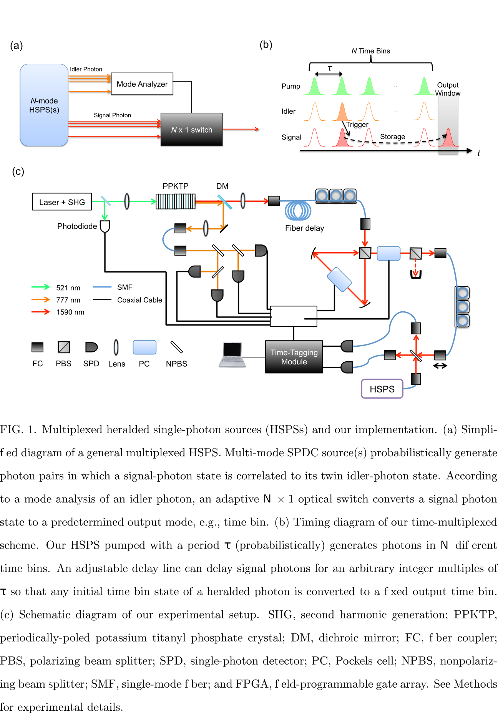

# High-efficiency single-photon generation via large-scale active time multiplexing {{"Kaneda2018"|cite}}

On-demand generation of indistinguishable single- and multi-photon states
is a key technology for scaling up optical quantum information and commu-
nication applications. Nonlinear parametric photon-pair sources and heralded
single-photon sources (HSPSs) had been the most standard resource of quantum
information applications for decades. However, the intrinsic uncertainty of
the produced number of photon pairs in such sources is a critical drawback that
prevents on-demand photon-pair and heralded single-photon generation. Here
we demonstrate large-scale time multiplexing of indistinguishable heralded sin-
gle photons, employing a low-loss HSPS and adjustable delay line. We observed
66.7±2.4% presence probability of single-photon states collected into a singlemode optical fiber by multiplexing 40 periodic time bins of heralded single pho-
tons. To our knowledge, this is the highest fiber-coupled single-photon probabil-
ity achieved to date. A high indistinguishability (∼90%) of our time-multiplexed
photons has also been confirmed. We also experimentally investigate trade-off
relations of single-photon probability and unwanted multiphoton contribution
by using different pump powers for a HSPS. Our results demonstrate that low-loss, large-scale multiplexing can realize highly efficient single-photon generation
as well as highly scalable multi-photon generation from inefficient HSPSs. We
predict that our large-scale time multiplexing will pave the way toward genera-
tion of > 30 coincident photons with unprecedented efficiencies, enabling a new
frontier in optical quantum information processing.

In general multiplexing methods (see Fig. 1a), a twin photon (signal photon) generated by
multi-mode, probabilistic SPDC processes is rerouted to a single mode by adaptive opti-
cal switches controlled in accordance with a mode analysis of the other twin photon (idler
photon), whose mode is correlated (or entangled) to that of the “heralded” signal photon.
In this case, the single-photon generation probability is no longer constrained by the 25%
limit, and can reach as high as a multiplexed heralding probability
$$
P_H=1-(1-p)^N
$$
where N is the number of multiplexed modes and p is the probability of a trigger detector
signal per mode, i.e., approximately the product of μ and the trigger system detection
efficiency η T for one SPDC mode.

The
time-multiplexing technique successfully enhances the single-photon generation probability
without increasing the multi-photon noise relative to the single-photon fraction.

* Heralded single photons(HSPSs)

  Pairs of single photons can be generated in highly correlated states from using a single high-energy photon to create two lower-energy ones. One photon from the resulting pair may be detected to 'herald' the other (so its state is pretty well known prior to detection). The two photons need not generally be the same wavelength, but the total energy and resulting polarisation are defined by the generation process.
  There are two commonly used types of heralded single-photon sources: spontaneous parametric down-conversion and spontaneous four-wave mixing. The first source has line-width around THz and the second one has line-width around MHz or narrower. 

* Second harmonic generation(SHG) 

  Second harmonic generation (**SHG**, also called **frequency doubling**) is a nonlinear optical process in which two photons with the same frequency interact with a nonlinear material, are "combined", and generate a new photon with twice the energy of the initial photons 

* Periodically poled potassium titanyl phosphate (PPKTP)

  Potassium titanyl phosphate (KTP) is an inorganic compound with the formula KTiOPO4. It is a white solid. KTP is an important nonlinear optical material that is commonly used for frequency doubling diode pumped solid-state lasers

  Periodically poled potassium titanyl phosphate (PPKTP) consists of KTP with switched domain regions within the crystal for various nonlinear optic applications and frequency conversion. It can be wavelength tailored for efficient second harmonic generation, sum frequency generation, and difference frequency generation. The interactions in PPKTP are based upon quasi-phase-matching, achieved by periodic poling of the crystal, whereby a structure of regularly spaced ferroelectric domains with alternating orientations are created in the material.

  PPKTP is commonly used for Type 1 & 2 frequency conversions for pump wavelengths of 730-3500 nm.

* dichroic mirror(DM)

  A dichroic filter, thin-film filter, or interference filter is a very accurate color filter used to selectively pass light of a small range of colors while reflecting other colors. By comparison, dichroic mirrors and dichroic reflectors tend to be characterized by the colors of light that they reflect, rather than the colors they pass.

* Pockels cell(PC)

  Pockels cells are voltage-controlled wave plates. The Pockels effect is the basis of the operation of Pockels cells. Pockels cells may be used to rotate the polarization of a beam that passes through.

