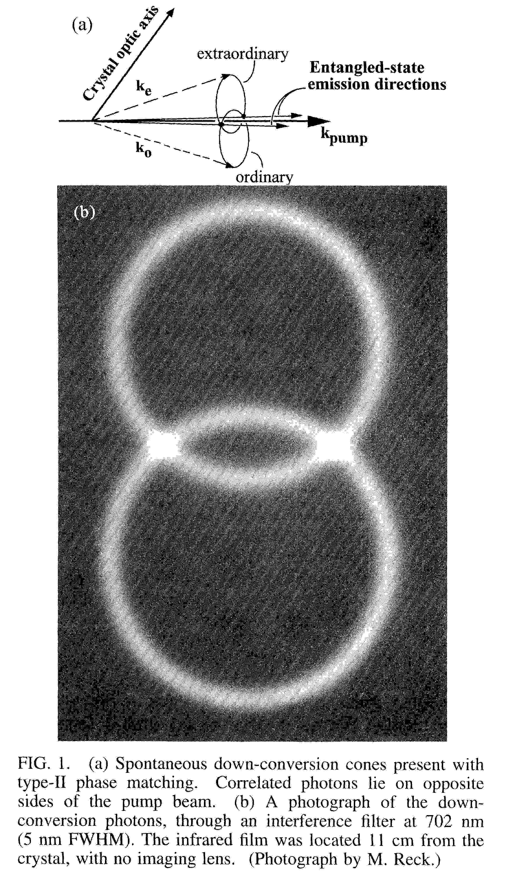
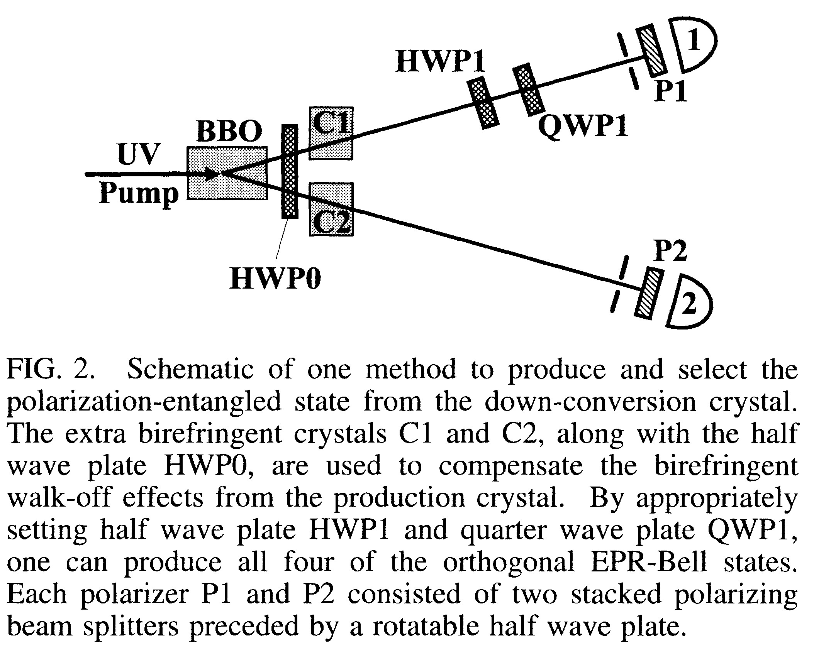

# New High-Intensity Source of Polarization-Entangled Photon Pairs{{"Kwiat1995"|cite}}

We report on a high-intensity source of polarization-entangled photon pairs with high momentum
definition.Type-ll noncollinear phase matching in parametric down conversion produces true
entanglement: No part of the wave function must be discarded, in contrast to previous schemes.
With two-photon fringe visibilities in excess of 97%, we demonstrated a violation of Bell’s inequality
by over 100 standard deviations in less than 5 min. The new source allowed ready preparation of all
four of the EPR-Bell states.

To date, most of the experiments with photons from
spontaneous parametric down conversion have used type-I
phase matching, in which the correlated photons have the
same polarization. There, for the case of degenerate
emission, a pair of photons with equal wavelength emerge
on a cone, which is centered on the pump beam and whose opening angle depends on the angle 6pm
between the crystal optic axis and the pump. With type-II
phase matching, the down—converted photons are emitted
into two cones, one ordinary polarized, the other
extraordinary polarized. In the collinear situation
the two cones are tangent to one another on exactly one
line, namely, the pump beam direction. If 6pm is
decreased, the two cones will separate from each other
entirely. However, if the angle is increased, the two
cones tilt toward the pump, causing an intersection along
two lines (see Fig. 1). Along the two directions
(“1” and “2”), where the cones overlap, the light can be
essentially described by an entangled state:
$$
|\psi \rangle=(|H_1,V_2 \rangle+e^{i \alpha}|V_1,H_2 \rangle)/\sqrt{2}
$$
where H and V indicate horizontal (extraordinary) and
vertical (ordinary) polarization, respectively. The relative
phase oz arises from the crystal birefringence, and an
overall phase shift is omitted.

Because the photons are produced coherently along the
entire length of the crystal, one can completely compensate for the longitudinal walk-off—after compensation, interference occurs pairwise between processes
where the photon pair is created at distances $$\pm x$$ from the
middle of the crystal. The ideal compensation therefore
uses two crystals, one in each path, which are identical
to the down-conversion crystal, but only half as long. If
the polarization of the light is first rotated by 90° (e.g.,
with a half wave plate), the retardations of the $$o$$ and the
$$e$$ components are exchanged and complete temporal indistinguishability is restored ($$\delta T=0$$). The same
method provides the optimal compensation for the transverse
walk-off effect as well

