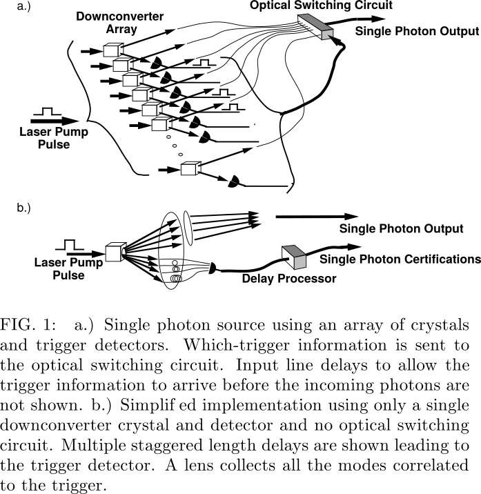

# Tailoring single-photon and multiphoton probabilities of a single-photon on-demand source{{"Migdall2002"|cite}}

We describe
a multiplexed system that allows the probabilities of producing one and more photons to be adjusted
independently, enabling a much better approximation of a source of single photons on demand.

The improvement presented here allows these two competing requirements to be adjusted independently by decoupling $$P_1$$ and $$P _{>1}$$ . This is accomplished
using an array of downconverters and detectors (Fig. 1a)
pumped simultaneously by the same laser pulse. 

While the scheme just described is conceptually the
simplest way of presenting the method, there are a number of modifications that can improve the efficiency, construction, and convenience of the system. The first of
these is that the array of downconverters can be implemented with a single PDC crystal. This is possible because while phasematching requires a PDC photon pair
to be constrained to a plane containing the pump beam,
the azimuthal angle is not constrained. Thus, the PDC
process produces light distributed azimuthally around
the pump laser direction (for type I phasematching).

A second modification allows the array of detectors to
be replaced by a single detector. By sending each of
the potential herald photons to an increasing sequence
of delays and then directing the delay outputs to a single detector, the timing of the detector pulse indicates which of the input downconverters has created a pair.

A third implementation (Fig. 1b) even eliminates the
output switching network circuit, while still maintaining
a significant advantage over both the conventional PDC
and faint laser photon sources.

The basic reason that this arrangement can produce
single photons with lower probability of multiple photons
is that the delay system provides extra information about
the photons produced.

