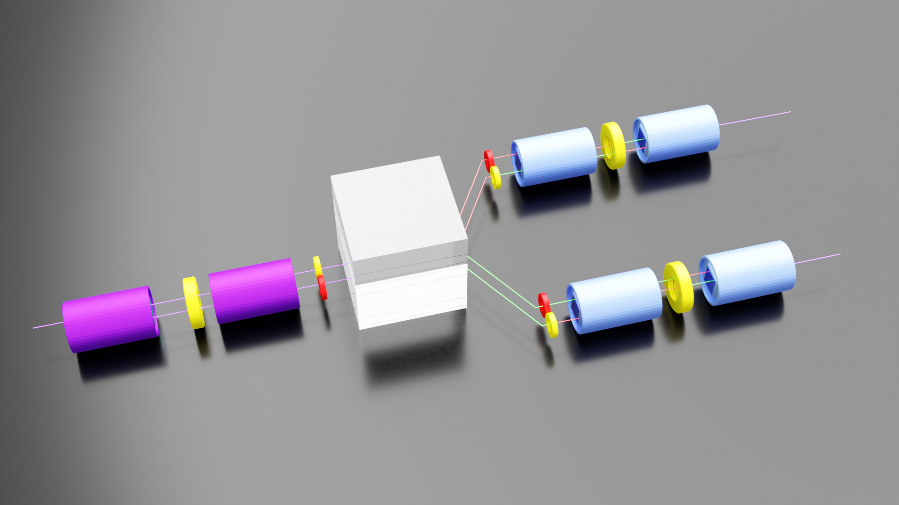
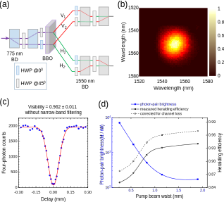
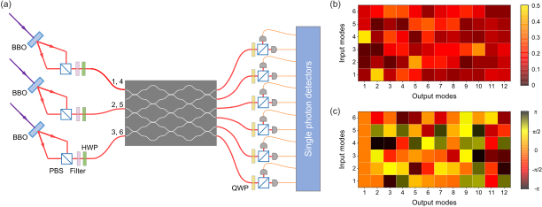

# Gaussian Boson Sampling{{"Zhong2019"|cite}}

Contrary to the existing protocols,
where the sampling matrix is directly given by the unitary of
the interferometer, here the sampling matrix absorbs both the action of the interferometer and the overall shape of the
Gaussian input state. We use a coherent superposition of all
N-photon patterns from the Gaussian input and we do not
herald an exact input pattern, as opposed to the other
protocols where both input and output patterns determine
the sampling problem. These two observations loosen the
requirement on having single photon Fock states at the input
and we are able to retain higher order photon number
contributions from the same input mode.

##　Promise

1. significantly enhances the photon generation probability
2. dense subgraph problems
3. molecular vibronic spectra
4. molecular docking
5. quantum speed-up on a NP-hard optimization problem

## Challenge

1. reliable sources of single photons
   
2. The most crucial resource for performing the GBS is degenerate
   squeezed vacuum state with high efficiency and high purity, simultaneously. Possible frequency correlation in the PDC will either
   reduce the Hong-Ou-Mandel quantum interference visibility or
   reduce the efficiency by passive spectral filtering
   
3. the relative input
   phases of each PDC can also affect the sampling distribution in the GBS
   
   In {{"Zhong2019"|cite}}, only one second is selected to analyze. In this way, the change of phase is small.

## Realization

1. developed a wavelength-degenerate, frequency uncorrelated
   PDC source with near-unity collection efficiency{{"Zhong2018a"|cite}}
   
   
   
   
   
   FIG. 1. The design and performance of our new SPDC
   entangled-photon source. (a) The interferometric two-photon
   entanglement source. The laser beam is split into two beams
   by two 775-nm BDs and HWPs and focused on a BBO crystal at
   two different spot to generate photon pairs via type-II beamlike
   SPDC. The green (red) lines represents H (V) polarization.
   (b) The measured joint spectrum of the photon pair, indicating
   the two photons are free of frequency correlations. (c) Hong-Ou-
   Mandel–type interference of two photons from two independent
   SPDC, measured without narrow-band filtering. (d) The mea-
   sured heralding efficiency and photon-pair brightness as a
   function of the pump beam waist.
   
   For the photon pair free
   from any correlation in their spatiotemporal degrees of
   freedom, it is necessary that the two-photon joint amplitude
   function is factorable. We find a suitable parameter
   regime that fulfills the condition.
   
   Employ four pairs of dispersion-compensating prisms to eliminate the dispersion.
   
2. 

    Experimental setup for GBS. (a) Three pairs of degenerate-frequency uncorrelated two-mode squeezed vacuum states are generated by three laser-
    pumped BBO crystals and coupled into a 12-mode optical interferometer, which includes six spatial modes and two polarization modes. From top to bottom the input modes
    are labelled as [1,4 ,2 ,5 ,3 ,6 ], and the output modes are labelled from 1 to 12. Superconducting nanowire single-photon detectors are employed to perform threshold
    detection in each output mode. In (b) and (c) we show the amplitudes and phases of the measured transformation matrix.

3. 12 modes: 2 polarization modes and six spatial modes

4. half-wave plates and quarter-wave plates  with random orientations are used to obtain a random transformation between different polarization modes

## The hypotheses to be ruled out
Boson sampling{{"Tichy2014"|cite}}
$$
P_{\mathrm{B}}(\vec{r}, \vec{s} ; U)=\frac{1}{\prod_{j} r_{j} ! s_{j} !}|\operatorname{perm}(M)|^{2}
$$
1. Distinguishable single photons
   $$
   \begin{aligned} P_{\mathrm{D}}(\vec{r}, \vec{s} ; U) &=\frac{1}{\prod_{j=1}^{n} s_{j} !} \sum_{\sigma \in S(1, \ldots, N) \}} \prod_{k=1}^{N}\left|M_{k, \sigma(k)}\right|^{2} \\ &=\frac{1}{\prod_{j=1}^{n} s_{j} !} \operatorname{perm}\left(|M|^{2}\right) \end{aligned}
   $$

2. Thermal state {{"RahimiKeshari2015"|cite}}
   $$
   p(\mathbf{n})=\left(\prod_{s=1}^{M} \mu_{s}\right) \operatorname{Per}\left([\tilde{\mathbf{D}}]_{N \times N}\right)
   $$
   $$V_{x_{s}} $$: x quadrature, $$V_{p_{s}} $$: p quadrature

$$
\mu_{s}=\frac{1}{V_{x_{s}}+1}+\frac{1}{V_{p_{s}}+1},\boldsymbol{\mu}=\operatorname{diag}\left(\mu_{1}, \ldots, \mu_{M}\right)
$$

The probabilities of having $$N$$ simultaneous single-photon detections at the output are proportional to permanents of $$N × N$$ submatrices of the Hermitian matrix $$\tilde{\mathbf{D}}$$,
   denoted by $$\tilde{\mathbf{D}}_{N\times N}$$ . The submatrices are obtained by removing $$M - N$$ rows and the same $$M - N$$ columns
   corresponding to those output modes from which 
   photon was detected. Notice that we have $$\tilde{\mathbf{D}}=\mathbf{U}\tilde{\mathbf{\mu}}\mathbf{U}^\dagger$$
   where the elements of matrix $$\tilde{\mathbf{\mu}}$$ are $$1 − μ_j \delta_{ij} ≥ 0$$; hence,
   $$\tilde{\mathbf{D}}$$ and its principal submatrices $$\tilde{\mathbf{D}}_{N\times N}$$ are positive-semidefinite Hermitian matrices.

3. Uniform sampler

   $$ P=constant$$

### likelihood ratio test{{"Spagnolo2014"|cite}}

Let
and $$q^{dis}_i,p^{ind}_i$$ be the probabilities associated with indistinguishable and
distinguishable photons for the measured outcome, and let $$D$$ be the discrimination
parameter, initialized to the value $$D = 0$$. For each experimental outcome, we
calculate the ratio of the expected probabilities for indistinguishable and
distinguishable photons. If the ratio is close to one, up to a threshold
$$k_1<p^{ind}_i/q_i^{dis}<1/k_1 $$, the event is considered to be inconclusive and $$D$$ is left
unchanged. These inconclusive events, however, are still counted as a resource and
do contribute to the effective number of events required to discriminate the two distributions. If $$1/k_1 ≤ p^{ind}_i /q_i^{dis} < k_2$$ , the event is assigned to the boson sampler
dis
by adding $$+1$$ to $$D$$. If the ratio between the two probabilities is high, $$p^{ind}_i /q_i^{dis} ≥ k_2$$ ,
the event is assigned to the boson sampler by adding $$+2$$ to $$D$$, thus reflecting the
higher level of confidence in this case. Conversely, if $$1/k_2 <p^{ind}_i/q_i^{dis} ≤ k_1$$ and
$$p^{ind}_i /q_i^{dis} ≤ 1/k_2$$ the event is assigned to the distinguishable sampler by adding $$-1$$ and $$-2 $$ to $$D$$, respectively. Finally, after $$N $$ experimental outcomes, if $$D>0 $$ the
whole data set is assigned to the boson sampler and conversely if $$D<0$$.

Here
$$
C_k=\left\{\begin{array}{cc}{C_{k-1}-2} & {L_{k}<a_{1}} \\ {C_{k-1}-1} & {a_{1} \leq L_{k}<a_{2}} \\ {C_{k-1}} & {a_{2} \leq L_{k}<1 / a_{2}} \\ {C_{k-1}+1} & {1 / a_{2} \leq L_{k}<1 / a_{1}} \\ {C_{k-1}+2} & {1 / a_{1} \leq L_{k}}\end{array}\right.
$$
where $$a_1 = 0.5$$ and $$a_2 = 0.9$$ .

## Error

There are many sources of error in our experiment; understanding and controlling the errors is
perhaps the central challenge an experimentalist will face. At the most obvious level:

1. Generation of single-photon Fock states will not be perfectly reliable.
2. The beamsplitters and phaseshifters will not induce exactly the desired unitary transformations.
3. Each photon will have some probability of “getting lost along the way.”
4. The photodetectors will not have perfect efficiency.
5. If the lengths of the optical fibers are not well-calibrated, or the single-photon sources are not
   synchronized, or there is vibration, etc., then the photons will generally arrive at the photodetectors
   at different times.

## Concepts

#### Squeezed state

 In physics, a squeezed coherent state is a quantum state that is usually described by two non-commuting observables having continuous spectra of eigenvalues. Examples are position x  and momentum p of a particle

##### squeezing operator

$$|\alpha ,\zeta \rangle =D(\alpha )S(\zeta )|0\rangle $$

$${\displaystyle D(\alpha 
)=\exp(\alpha {\hat {a}}^{\dagger }-\alpha ^{*}{\hat {a}})\qquad 
{\text{and}}\qquad S(\zeta )=\exp {\bigg [}{\frac {1}{2}}(\zeta 
^{*}{\hat {a}}^{2}-\zeta {\hat {a}}^{\dagger 2}){\bigg ]}}$$

For a quantum harmonic oscillator of angular frequency ω , these operators are given by 

$${\displaystyle {\hat 
{a}}^{\dagger }={\sqrt {\frac {m\omega }{2\hbar }}}\left(x-{\frac 
{ip}{m\omega }}\right)\qquad {\text{and}}\qquad {\hat {a}}={\sqrt {\frac
{m\omega }{2\hbar }}}\left(x+{\frac {ip}{m\omega }}\right)}$$

For a real ζ  , (note that $${\displaystyle \zeta =re^{2i\phi }}$$, where r is squeezing parameter),the uncertainty in x and p are given by 

$${\displaystyle (\Delta 
x)^{2}={\frac {\hbar }{2m\omega }}\mathrm {e} ^{-2\zeta }\qquad 
{\text{and}}\qquad (\Delta p)^{2}={\frac {m\hbar \omega }{2}}\mathrm {e}
^{2\zeta }}$$

#### Fock state

an element of a Fock space with a well-defined number of particles

#### max-Haf problem

The goal is to find a k-
vertex subgraph with the largest Hafnian (in absolute value).

#### Hafnian

In mathematics, the hafnian of an adjacency matrix of a graph is the number of perfect matchings in the graph.

The hafnian of a 2n × 2n symmetric matrix is computed as

$$
{\displaystyle \operatorname {haf} (A)={\frac {1}{n!2^{n}}}\sum _{\sigma \in S_{2n}}\prod _{j=1}^{n}A_{\sigma (2j-1),\sigma (2j)},}
$$

 where $$\displaystyle{S_{2n}}$$ is the symmetric group on [*2n*].

Equivalently,
$$
\operatorname {haf}(A)=\sum_{M\in {\mathcal{M}}}\prod_{\scriptscriptstyle(u,v)\in M}A_{u,v}
$$
where $${\mathcal{M}}$$ is the set of all 1-factors (perfect matchings) on the complete graph $${\displaystyle K_{2n}}$$, namely the set of all $$ {\displaystyle (2n)!/(n!2^{n})} $$ways to partition the set $${\displaystyle \{1,2,\dots ,2n\}}$$ into $$n$$ subsets of size $$2$$.

#### Wigner function

The goal was to link the wavefunction that appears in Schrödinger's equation to a probability distribution in phase space. 
$$
{\displaystyle W({\vec 
{r}},{\vec {p}})={\frac {1}{(2\pi )^{3}}}\int \psi ^{*}({\vec {r}}+\hbar
{\vec {s}}/2)\psi ({\vec {r}}-\hbar {\vec {s}}/2)e^{i{\vec {p}}\cdot 
{\vec {s}}}\,d^{3}s.}
$$