# Multi-photon entanglement and interferometry {{"Pan2012"|cite}}
## Abstract
Multi-photon interference reveals strictly non-classical phenomena. Its applications range from
fundamental tests of quantum mechanics to photonic quantum information processing, where a
significant fraction of key experiments achieved so far comes from multi-photon state manipulation. We review the progress, both theoretical and experimental, of this rapidly advancing
research. The emphasis is given to the creation of photonic entanglement of various forms, tests
of the completeness of quantum mechanics (in particular, violations of local realism), quantum
information protocols for quantum communication (e.g., quantum teleportation, entanglement purification and quantum repeater), and quantum computation with linear optics. We shall limit the
scope of our review to “few photon” phenomena involving measurements of discrete observables.

## INTERFERENCE AND QUANTUM ENTANGLEMENT
We discuss here the basic differences between the classical interference understood as interference of electro-magnetic
waves in space, and the quantum one which is interference of various operationally indistinguishable processes.
### Classical interference
Consider two quasi-monochromatic plane waves linearly polarized in the same direction, described by
$$
E_j(\mathbf{r},t)==E_je^{i[\mathbf{k_j}\cdot\mathbf{r}-\omega t- \phi_j(t) ]}+c.c.
$$
finally c.c. denotes
the complex conjugate of the previous expression. The
intensity of the superposed fields at a certain point in
space is given by
$$
I(\mathbf{r},t)=E_1^2+E_2^2+2E_1E_2\cos[\Delta_{12}\mathbf{k}\cdot\mathbf{r}-\Delta_{12} \phi(t)]
$$
The Hanbury Brown and Twiss experiment introduced
intensity correlation measurements to optics. Such correlations between two points in space and two moments of
time, for two classical fields are described by an intensity
correlation function
$$
G^{(2)}(\mathbf{r_1},t_1;\mathbf{r_2},t_2)= \langle I(\mathbf{r_1},t_1)I(\mathbf{r_2},t_2) \rangle_{av}
$$
The average is taken over an ensemble, and for stationary fields this is equivalent to the temporal average. Even
when no intensity variations are observable (i.e., for averaged intensity constant in space), the intensity correlations can reveal interference effects. Assume that the
phases of the two fields fluctuate independently of one
another. Then for $$t_1 = t_2$$ , the $$G^{(2)}$$ function still ex-hibits a spatial modulation or maximal visibility of 50%
as exhibited by the formula:
$$
G^{(2)}(\mathbf{r},t;\mathbf{r},t)=(I_1+I_2)^2+2I_1I_2\cos[(\Delta_{12}\mathbf{k})(\mathbf{r_1}-\mathbf{r_2})]
$$
where $$I_i = E_i^2 , i = 1, 2$$. This formula can be easily
reached by noting that the temporal average of
$$
\cos[\alpha+\Delta_{12}\phi(t)]\cos[\alpha'+\delta_{12}\phi(t)]=\frac{1}{2}[\cos(\alpha- \alpha')+\cos(\alpha+\alpha'+2 \Delta_{12}\phi(t))]
$$
where $$\Delta_{12}\phi(t))=\phi_1(t)-\phi_2(t) $$, is given by
$$
\frac{1}{2}\cos(\alpha- \alpha')+\frac{1}{2}\langle\cos(\alpha+\alpha'+2 \Delta_{12}\phi(t))\rangle_{av}
$$
and due to the random nature of $$\Delta_{12}\phi(t))$$only the first term survive
Thus, the
visibility of intensity correlations for fields with fluctuat-
ing phase differences is never full, maximally 50%.
### Quantum interference
#### Single-particle quantum interference
In the classical particle picture one would expect that a process originating with state A and with possible intermediate stages $$B_1 , \dots ,B_N $$, leading to an event
C, would be described by
$$
P(C|A)=\sum^N_{j=1}P(C|B_j)P(B_j|A)\tag{C}
$$
In the quantum case $$P(C|A)=| \langle C|A \rangle|^2$$,where
$$
\langle C|A \rangle=\sum^N_{j=1} \langle C|B_j \rangle \langle B_j|A \rangle\tag{Q}
$$
The difference between (C) and (Q) is in the assumption, inherent in (C), that the particle had to be in one
of the intermediate situations (states) $$B_i$$ . In the quantum case any attempt to verify by measurement 5 which
of the situations actually took place puts one back to the
classical formula (C). The formula (Q) leads to interference phenomena, and may be thought as a manifestation
of a wave nature of quantum particles, whereas, if we
make measurements discriminating events $$B_i$$ , we learn
by which way (welcher weg) the particles travel. The
“which-way information”is a clear signature of the particle nature.
#### Two-particle quantum interference
Consider such a correlation: assume that if particle 1
is at $$b_1$$ , then particle 2 is also at $$b_1$$ , and, whenever 1
is at $$b_2$$ then particle 2 is at $$b_2$$ . Later on the particles
are detected at two different points, $$\mathbf{x_1}$$ and $$\mathbf{x_2}$$ . Then,
according to the rules given above
$$
\begin{align}
P(\mathbf{x_1},\mathbf{x_2},t)&\sim|A_{b_1}(\mathbf{x_1},t)A_{b_1}(\mathbf{x_2},t)+A_{b_2}(\mathbf{x_1},t)A_{b_2}(\mathbf{x_2},t)|^2\\
&\sim 1+\cos(\Delta\mathbf{k_1}\cdot\mathbf{x_1}+\Delta\mathbf{k_2}\cdot\mathbf{x_2}+\Delta \Phi_{b_1,b_2})
\end{align}
$$
Thus, if the phase relation between the two
amplitudes is stable one can have absolutely noiseless interference with 100% visibility, while there is no single particle interference:
$$
P(\mathbf{x_1},t)=\int d\mathbf{x_2}P(\mathbf{x_1},\mathbf{x_2},t)=const
$$
As we shall see, the unbounded visibility is not the only
feature by which two-particle interference differs from
classical one.(It seems that this paragraph is trying to compare the visibility between classical cases and quantum cases, but there may be some logic flaws, because it wants to compare the visibility of $$G^{(2)}$$ with that of probablity)
### Quantum entanglement
$$
| \psi \rangle _ { 12 } = \frac { 1 } { \sqrt { 2 } } ( | \uparrow \rangle _ { 1 } | \downarrow \rangle _ { 2 } - | \downarrow \rangle _ { 1 } | \uparrow \rangle _ { 2 } )
$$
where, e.g., $$| \uparrow \rangle _ { 1 }  | \downarrow \rangle _ { 1 } )$$ describes the state of particle 1
with its spin up (down) along the z-direction. The minus sign is necessary to get the rotational invariance.
The spin state of one of the particles is described
by a reduced density operator 6 , which is a totally random state $$\frac { 1 } { 2 } I _ { k }$$ and $$I _ { k } = | \uparrow \rangle _ { k k } \langle \uparrow | + | \downarrow \rangle _ { k k } \langle \downarrow |$$is the unit operator for a
given subsystem. 

A hermitian operator $$\hat { W }$$ is an entanglement witness if for
all separable states one has $$\operatorname { Tr } \left( \hat { W } \varrho _ { \operatorname { sep } } \right) \geq 0$$, whereas there
exists an entangled state for which one has $$\operatorname { Tr } \left( \hat { W } \varrho _ { \operatorname { sep } } \right) < 0$$. Thus, via measurement of a suitably chosen witness
operator one can detect entanglement.
### Interferometry with entangled two- and multi-photon states
#### EPR interferometry

 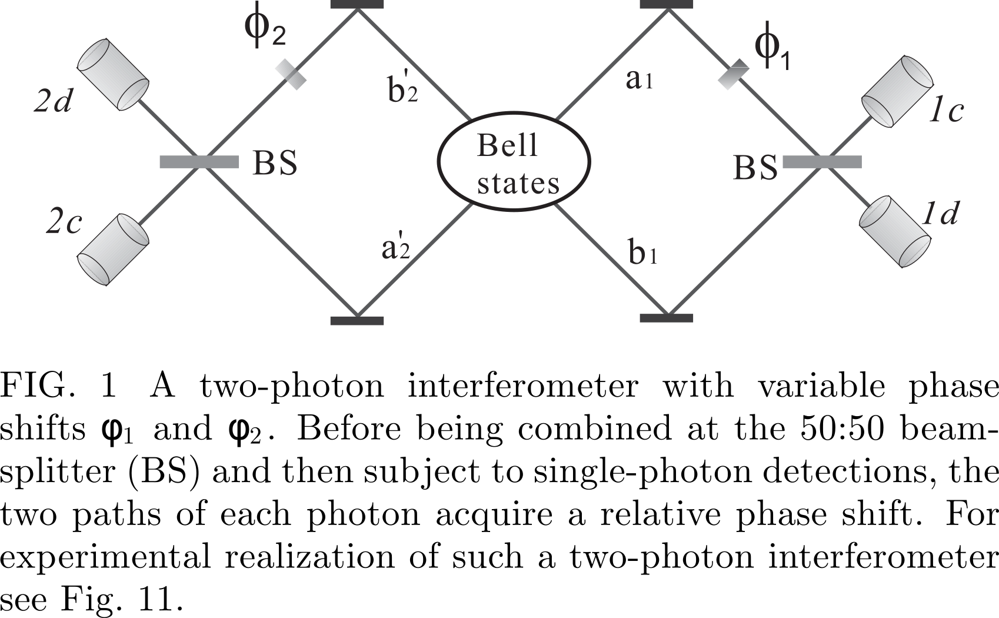

We assume that a central
source emits two photons in an entangled state
$$
| \psi \rangle _ { 12 } = \frac { 1 } { \sqrt { 2 } } ( | a \rangle _ { 1 } | a ^ { \prime } \rangle _ { 2 } + | b \rangle _ { 1 } | b ^ { \prime } \rangle _ { 2 } )
$$
By taking into account the phase shifts $$\phi_1$$ and $$\phi_2$$(The terms times $$\phi_i$$ respectively) and
the action of the two beamsplitters($$|a \rangle\to\frac{1}{\sqrt{2}}(i|c \rangle+|d \rangle)$$,$$|b \rangle\to\frac{1}{\sqrt{2}}(|c \rangle+i|d \rangle)$$), the probabilities of
the coincidence detections of two photons at the detector
pairs ($$\mathrm { D } _ { 1 c / d } , \mathrm { D } _ { 2 c / d }​$$ ) read
$$
\begin{aligned} p _ { 1 c , 2 d } \left( \phi _ { 1 } , \phi _ { 2 } \right) & = p _ { 1 d , 2 c } \left( \phi _ { 1 } , \phi _ { 2 } \right) = \frac { 1 } { 4 } \left[ 1 + \cos \left( \phi _ { 1 } - \phi _ { 2 } \right) \right] \\ p _ { 1 c , 2 c } \left( \phi _ { 1 } , \phi _ { 2 } \right) & = p _ { 1 d , 2 d } \left( \alpha , \phi _ { 2 } \right) = \frac { 1 } { 4 } \left[ 1 - \cos \left( \phi _ { 1 } - \phi _ { 2 } \right) \right] \end{aligned}
$$
Thus, by simultaneously monitoring the detectors on
both sides of the interferometer, while varying the phase
shifts $$\phi_1$$ and $$\phi_2​$$, the interference fringes will be observed
as shown by the sinusoidal terms. In contrast, for any single detector the count rate shows no interference at all.

#### GHZ interferometry

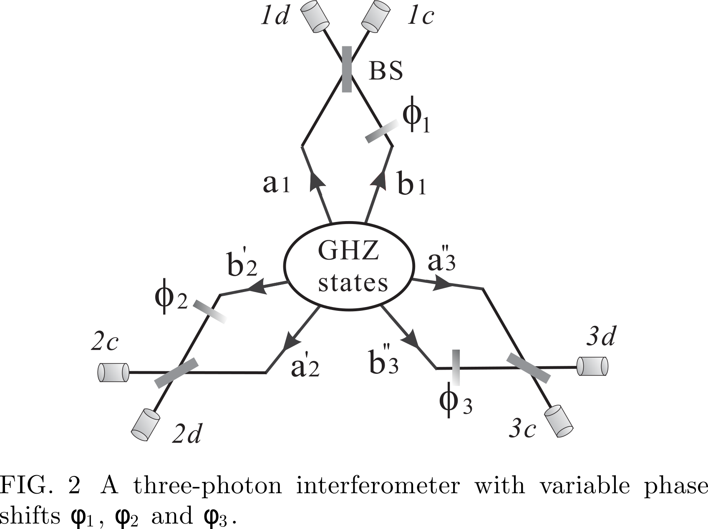

$$
| \mathrm { GHZ } \rangle _ { 123 } = \frac { 1 } { \sqrt { 2 } } ( | a \rangle _ { 1 } | a ^ { \prime } \rangle _ { 2 } | a ^ { \prime \prime } \rangle _ { 3 } + | b \rangle _ { 1 } | b ^ { \prime } \rangle _ { 2 } | b ^ { \prime \prime } \rangle _ { 3 } )
$$
$$
\begin{aligned} p _ { 1 c , 2 c , 3 c } \left( \phi _ { 1 } , \phi _ { 2 } , \phi _ { 3 } \right) & = \frac { 1 } { 8 } \left[ 1 + \sin \left( \phi _ { 1 } + \phi _ { 2 } + \phi _ { 3 } \right) \right] \\ p _ { 1 d , 2 c , 3 c } \left( \phi _ { 1 } , \phi _ { 2 } , \phi _ { 3 } \right) & = \frac { 1 } { 8 } \left[ 1 - \sin \left( \phi _ { 1 } + \phi _ { 2 } + \phi _ { 3 } \right) \right] , \text { etc. } \end{aligned}
$$
## PHOTONIC QUBITS AND LINEAR OPTICS

A general (normalized) basis state of the Fock space is of the following form:
$$
| n _ { 1 } , n _ { 2 } , n _ { 3 } , \ldots \rangle = \prod _ { l = 1 } ^ { \infty } \frac { \hat { a } _ { l } ^ { \dagger n _ { l } } } { \sqrt { n ! } } | \Omega \rangle
$$
It is easy to see that if one defines the creation
operators with respect to an alternative basis of wave
packet profiles (here the primed ones) one has:
$$
\hat { a } _ { m } ^ { \prime \dagger } = \sum _ { n = 1 } ^ { \infty } U _ { m n } \hat { a } _ { n } ^ { \dagger }
$$
### Photonic qubits
A quantum bit, or qubit, is the most elementary unit
of quantum information. It is a generalization of the
classical bit, which has two distinguishable states “0”
and “1”. Similarly, we can have a qubit in two distinguishable, i.e., orthogonal states $$| 0 \rangle$$ and $$| 1 \rangle$$. However, in
contradistinction to its classical counterpart, a qubit can
be prepared as, or transformed to, any superposition of
these two states (normalization requires $$\alpha _ { 0 } ^ { 2 } + \alpha _ { 1 } ^ { 2 } = 1$$):
$$
| \Psi _ { \text { qubit } } \rangle = \alpha _ { 0 } | 0 \rangle + \alpha _ { 1 } | 1 \rangle
$$
Any isolated two-level system consisting of a pair of
orthogonal quantum states represents a qubit.
1. *Polarization qubits*  they can easily be created and
manipulated with high precision by simple linear-optical
elements such as polarizing beam splitters (PBS), polarizers and wave plates.
2. *Spatial qubits* Any state of spatial qubits can be prepared by
using suitable phase shifters and BSs. A disadvantage
of using spatial qubits is that the coherence between $$|a \rangle$$
and $$|b \rangle$$ is sensitive to the relative phase between the paths
a and b, and this is difficult to control in long-distance
cases.
3. *Time-bin qubits*

*Two-photon polarization entangled states.* The so-
called Bell states 14 form a basis in the four dimensional
two-qubit Hilbert space. Bell states of photonic polarization qubits can be for example:
$$
\begin{aligned} | \psi ^ { \pm } \rangle _ { 12 } & = \frac { 1 } { \sqrt { 2 } } ( | H \rangle _ { 1 } | V \rangle _ { 2 } \pm | V \rangle _ { 1 } | H \rangle _ { 2 } ) \\ | \phi ^ { \pm } \rangle _ { 12 } & = \frac { 1 } { \sqrt { 2 } } ( | H \rangle _ { 1 } | H \rangle _ { 2 } \pm | V \rangle _ { 1 } | V \rangle _ { 2 } ) \end{aligned}
$$
### Simple linear-optical elements
In the photonic domain, quantum states of photons can
be easily, and with a high precision, manipulated by simple passive linear-optical devices. These linear-optical elements include BS, polarizing beamsplitter (PBS), wave
plates and phase shifters. Classically, such devices conserve energy: The total input energy equals the total
output energy, and there is no energy transfer between
different frequencies. A passive linear optical device is
described by a unitary transformation of annihilation operators for the same frequency:
$$
\hat { a } _ { m } ^ { o u t } = \sum _ { m } U _ { m n } \hat { a } _ { n } ^ { i n }
$$
where U is a unitary matrix, and the indices denote a
basis of orthogonal modes.
The BS is one of the most important optical elements.The most commonly used BS is the symmetric 50:50 BS characterized by the
following transformation
$$
\begin{array} { c } { \hat { a } \longrightarrow \frac { 1 } { \sqrt { 2 } } \hat { c } + \frac { i } { \sqrt { 2 } } \hat { d } } \\ { \hat { b } \longrightarrow \frac { i } { \sqrt { 2 } } \hat { c } + \frac { 1 } { \sqrt { 2 } } \hat { d } } \end{array}
$$
The factor i is a consequence of unitarity. It describes a phase jump upon reflection

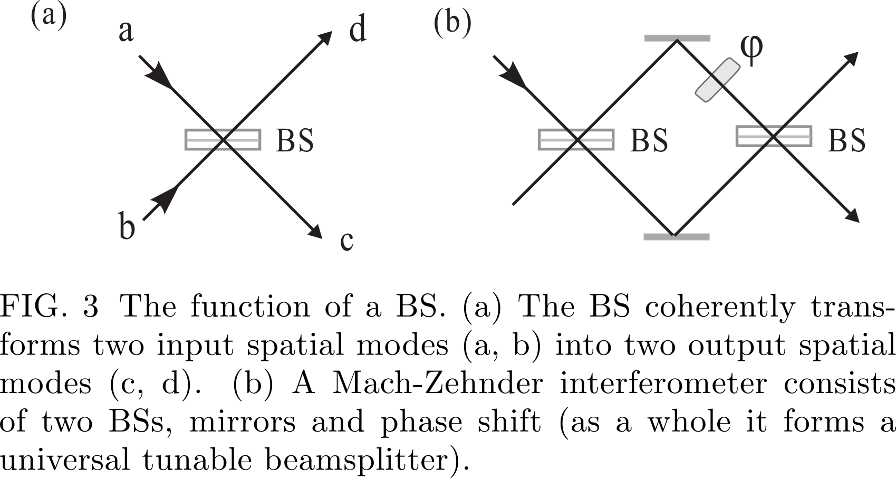

Another important component is the polarizing beam-splitter (PBS)
$$
\hat { a } _ { H } \rightarrow \hat { c } _ { H } \text { and } \hat { a } _ { V } \rightarrow i \hat { d } _ { V } ; \quad \hat { b } _ { H } \rightarrow \hat { d } _ { H } \text { and } \hat { b } _ { V } \rightarrow i \hat { c } _ { V }
$$

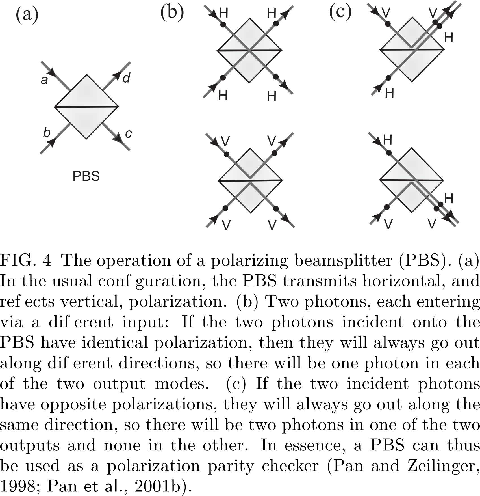

### Two-photon interference due to indistinguishability of photons
As we have seen previously, upon reflection off a symmetric 50:50 BS a photon picks a phase shift i. Denote
the input modes as a and b and output modes as c and d.
If we have two spectrally identical photons (of the same
polarization) each entering at exactly the same moment
an opposite input port of the BS, the initial state $$\hat { a } ^ { \dagger } \hat { b } ^ { \dagger } | \Omega \rangle$$,
is transformed into
$$
\frac { 1 } { \sqrt { 2 } } \left( \hat { c } ^ { \dagger } + i \hat { d } ^ { \dagger } \right) \frac { 1 } { \sqrt { 2 } } \left( \hat { d } ^ { \dagger } + i \hat { c } ^ { \dagger } \right) | \Omega \rangle \rightarrow \frac { i } { 2 } \left( \hat { c } ^ { \dagger 2 } + \hat { d } ^ { \dagger 2 } \right) | \Omega \rangle
$$
We have a cancellation of the two terms, $$\hat { c } \hat { d } - \hat { d } \hat { c } = 0$$
which describe the cases in which each photon exits by a
different exit port. This cancellation occurs if the two
photons are perfectly indistinguishable in terms of all
their other degrees of freedom such as frequency, time,
or polarization.

If the photons are at least partially distinguishable (in
this case we shall label the annihilation operators of the
photons with different subscripts as $$\hat { a } _ { 1 }$$ and $$\hat { b } _ { 2 }$$ ) the initial
state $$\hat { a } _ { 1 } ^ { \dagger } \hat { b } _ { 2 } ^ { \dagger } | \Omega \rangle$$ is transformed by a perfect 50:50 BS via
the relations in Eqn.28 into
$$
\frac { 1 } { \sqrt { 2 } } \left( \hat { c } _ { 1 } ^ { \dagger } + i \hat { d } _ { 1 } ^ { \dagger } \right) \frac { 1 } { \sqrt { 2 } } \left( \hat { d } _ { 2 } ^ { \dagger } + i \hat { c } _ { 2 } ^ { \dagger } \right) | \Omega \rangle
$$
### Post-selection of entanglement and quantum erasure

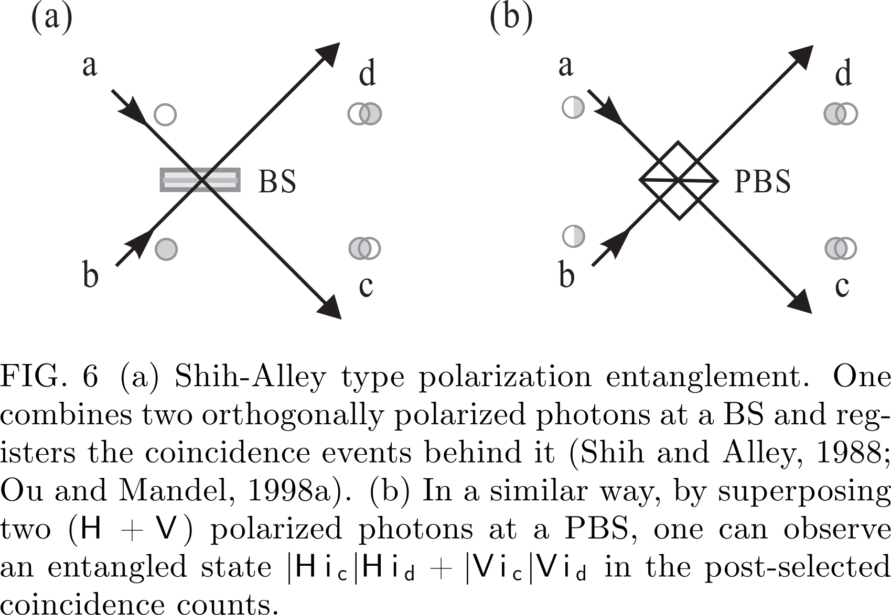

When analyzing the above experiments, one could be
mislead to suppose that the interference arises due to the fact that the wave packets of the two photons overlap at
the BS. However, it is important to note that essentially, the origin of this interference is due to the indistinguishability
of two-photon amplitudes describing the various alternatives leading to a coincidence count. To dispel a misconception that the photons must arrive at the BS at the
same time for some type of classical local “agreement”,
Pittman et al. (1996) performed a “postponed compensation” two-photon Shih-Alley type experiment. Interference is observed, even though the photons were arriving
at the BS at different times.

### Entangled-state analyzers

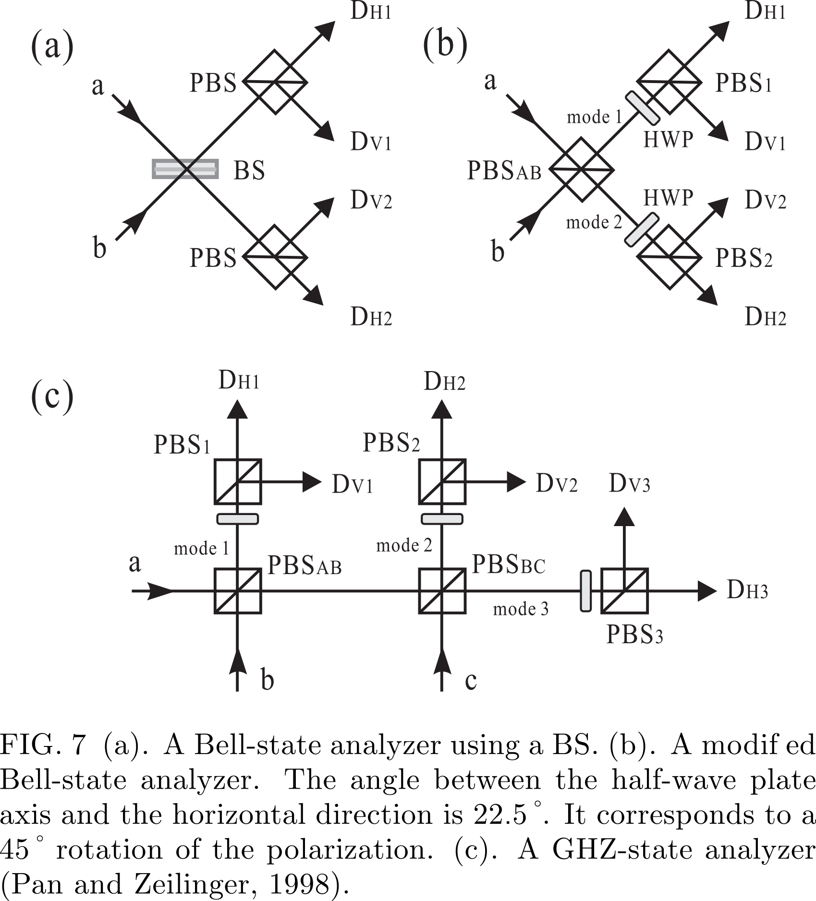
#### Bell-state analyzer
Specifically, for the incident state $$\frac { 1 } { \sqrt { 2 } } ( | H \rangle _ { a } | H \rangle _ { b } + | V \rangle _ { a } | V \rangle _ { b }$$ ) we always observe
a coincidence either between detectors $$\mathrm { D } _ { H 1 }$$ and $$\mathrm { D } _ { H 2 }$$ or
$$\mathrm { D } _ { V1 }$$ and $$\mathrm { D } _ { V2 }$$ . On the other hand, if the incident state is
$$\frac { 1 } { \sqrt { 2 } } ( | H \rangle _ { a } | H \rangle _ { b } - | V \rangle _ { a } | V \rangle _ { b }$$ ) we observe coincidence at detectors $$\mathrm { D } _ { H 1 }$$ and $$\mathrm { D } _ { V2 }$$ or $$\mathrm { D } _ { V 1 }$$ and $$\mathrm { D } _ { H 2 }$$ . The other two
Bell states would lead to no coincidence at detectors in
modes 1 and 2.

### GHZ-state analyzer

Bell state measurement schemes can be generalized to
the N-particle case. One can construct a GHZ-state analyzer, with which one can identify two out of the $$2^N$$ maximally entangled GHZ states.
In the case of three spectrally indistinguishable identical photons, eight maximally entangled polarization GHZ
states could be given by
$$
\begin{aligned} | \Phi _ { 0 } ^ { \pm } \rangle & = \frac { 1 } { \sqrt { 2 } } ( | H \rangle | H \rangle | H \rangle \pm | V \rangle | V \rangle | V \rangle ) \\ | \Psi _ { 1 } ^ { \pm } \rangle & = \frac { 1 } { \sqrt { 2 } } ( | V \rangle | H \rangle | H \rangle \pm | H \rangle | V \rangle | V \rangle ) \\ | \Psi _ { 2 } ^ { \pm } \rangle & = \frac { 1 } { \sqrt { 2 } } ( | H \rangle | V \rangle | H \rangle \pm | V \rangle | H \rangle | V \rangle ) \\ | \Psi _ { 3 } ^ { \pm } \rangle & = \frac { 1 } { \sqrt { 2 } } ( | H \rangle | H \rangle | V \rangle \pm | V \rangle | V \rangle | H \rangle ) \end{aligned}
$$
## EXPERIMENTAL REALIZATIONS OF PHOTONIC ENTANGLEMENT
### Spontaneous parametric down-conversion
If one shines strong laser light on a nonlinear crystal,
the pump photons have some probability to split into correlated pairs of lower energy. This is called spontaneous
parametric down conversion (SPDC). The new photons,
customarily called “signal” and “idler”, satisfy the following relations: for the wave vectors within the crystal
one has $$\mathbf { k } _ { 0 } \approx \mathbf { k } _ { i } + \mathbf { k } _ { s }$$ where subscripts 0, s and i denote,
respectively, pump, signal and idler wave vectors, and
the respective frequencies satisfy $$\omega _ { o } \approx \omega _ { i } + \omega _ { s }$$ . This is
usually called phase matching.
There are two different types of the process:
either signal and idler photons share the same polarization (type I) or they have perpendicular polarizations
(type II).
#### Types of entanglement
*Polarization entanglement* Currently the standard
method to produce polarization-entangled photons is the
noncollinear type-II SPDC process
$$
\frac { 1 } { \sqrt { 2 } } ( | H \rangle _ { A } | V \rangle _ { B } + e ^ { i \alpha } | V \rangle _ { A } | H \rangle _ { B } )
$$
After the compensation, interference
occurs pairwise between processes in which the photon
pair is created at distances $$\pm x$$ from the middle of the
crystal. The ideal compensation is therefore to use two
crystals, one in each path, which are identical with the
down-conversion crystal, but only half as long. If the
polarizations are rotated by $$90^\circ$$ (e.g., with a half wave
plate), the retardations of the o and e components are
exchanged and temporal indistinguishability is restored.
The method also provides reasonable compensation for
the transverse walk-off effect.
(WHY?)
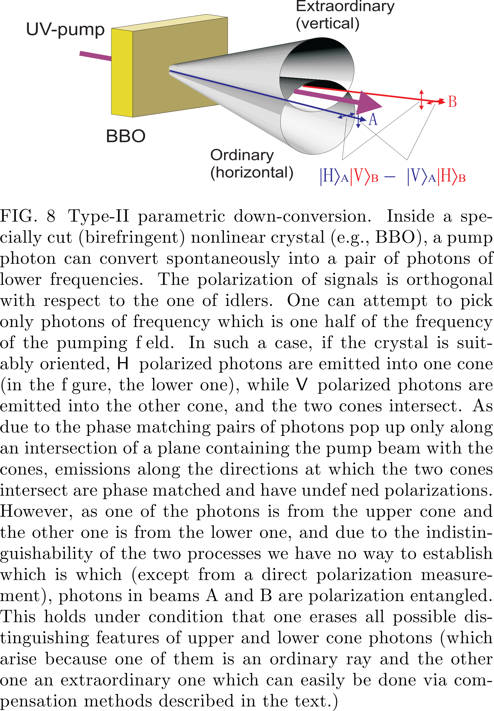
*Temporal entanglement*  
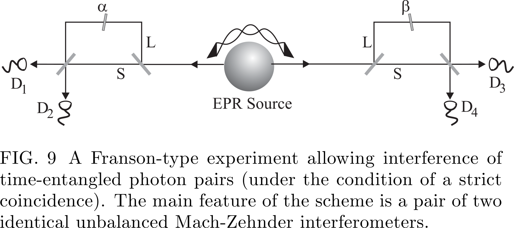
$$
\frac { 1 } { \sqrt { 2 } } ( | \operatorname { long } \rangle _ { 1 } | \operatorname { long } \rangle _ { 2 } + e ^ { i \phi } | \operatorname { short } \rangle _ { 1 } | \text { short } \rangle _ { 2 } )
$$
An advantage of the time-bin
entanglement is that it is insensitive to polarization fluctuations. Using reference laser pulses to actively lock the
phase, it can be robustly distributed over long distances
in optical fibers.
### Photonic entanglement in higher dimensions
#### Entangled qudits
Photonic entanglement in higher dimensions can in
principle be generated by SPDC processes in a form
of generalization of path or temporal entanglement into
more than two conjugate pairs of beams or time-bins, respectively, and analyzed with N-port beamsplitters
Another route is to use the photons' orbital angular momentum.
#### Hyper-entanglement
*Polarization-path entanglement*  Polarization-path entanglement can be generated by a double pass of a pump
laser through a BBO crystal. The
pump passes the crystal and is reflected to pass it again.
$$
| \Psi \rangle = | \psi ^ { - } \rangle _ { \mathrm { pol } } \otimes | \psi ^ { - } ( 0 ) \rangle _ { \mathrm { path } }
$$

*Polarization-time entanglement*   Using a “time-path
transmitter” introduced by Chen et al. (2006d), one can
realize a transformation between polarization-path and
polarization-time hyper-entanglement.

*Entanglement in multiple degrees of freedom*
By pumping two BBO crystals
with optical axes aligned in perpendicular planes, a two-photon $$( 2 \otimes 2 ) \otimes ( 3 \otimes 3 ) \otimes ( 2 \otimes 2 )$$-dimensional hyperentangled state was produced, approximately described
by
$$
\begin{array} { l } { \underbrace { ( | H H \rangle + | V V \rangle ) } _ { \text { polarization } } \otimes \underbrace { ( | 1 , - 1 \rangle _ { L G } + \alpha | 0,0 \rangle _ { L G } + | - 1,1 \rangle _ { L G } ) } _ { \text { spatial } } } \\ { \otimes \underbrace { ( | E E \rangle + | L L \rangle ) } _ { \text { energy-time } } } \end{array}
$$
Here $$\alpha$$ describes the orbital-angular-momentum spatial mode balance which is due the properties of the
source and the selection via the
mode-matching conditions.
### Twin-beam multi-photon entanglement
It is different
from multi-photon entanglement in which each spatially
separated photon represents a qubit, and can be individually manipulated and observed.

A simplified Hamiltonian responsible for generation
of polarization entangled SPDC photons can be put as
$$H _ { 0 } = i \kappa \left( a _ { H } ^ { \dagger } b _ { V } ^ { \dagger } - a _ { V } ^ { \dagger } b _ { H } ^ { \dagger } \right) + h . c .$$Horizontally (H) and vertically (V) polarized photons occupy two spatial modes
(a and b); $$\kappa$$ is a coupling constant that depends on
the nonlinearity of the crystal and the intensity of the
pump pulse. After the interaction time t the resulting photon state is given by $$| \psi \rangle = e ^ { - i t H _ { 0 } } | 0 \rangle$$ and in the number state representation reads
$$
\begin{aligned} | \psi \rangle & = \frac { 1 } { \cosh ^ { 2 } \tau } \sum _ { n = 0 } ^ { \infty } \sqrt { n + 1 } \tanh ^ { n } \tau | \psi _ { n } ^ { - } \rangle \\ | \psi _ { n } ^ { - } \rangle & = \sum _ { m = 0 } ^ { n } \frac { ( - 1 ) ^ { m } } { \sqrt { n + 1 } } | n - m , m ; m , n - m \rangle \end{aligned}
$$
A special twin-beam entanglement is the so-called
“high NOON” type state of two
beams:
$$
| \mathrm { NOON } \rangle = | N , 0 ; 0 , N \rangle = \frac { 1 } { \sqrt { 2 } } ( | N \rangle _ { a } | 0 \rangle _ { b } + | 0 \rangle _ { a } | N \rangle _ { b } )
$$
These experiments demonstrated an interesting feature of NOON states: the effective de Broglie
wavelength of the multiphoton state is by 1/N shorter
than the wavelength of the single photon

### Multi-photon entanglement

#### Entanglement construction

*Entangling two independent particles: the principle.* 

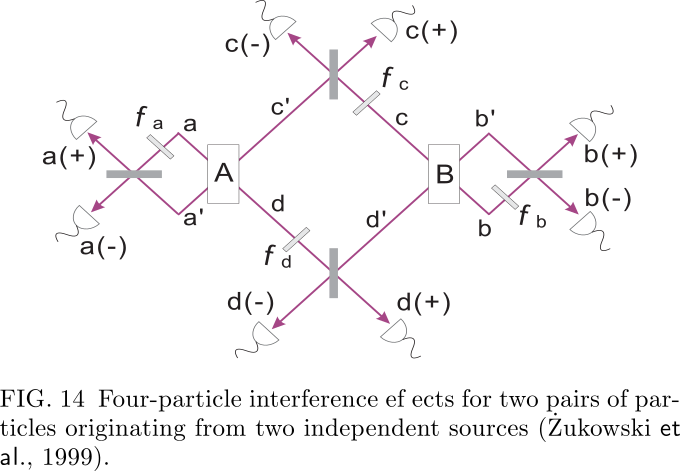

Note that depending on the phase shifts the detection at, e.g., c(+) and
d(+), acts like a Bell-state measurement, projecting the

two photons into the state $$ 
\frac{1}{\sqrt{2}}( |c^{\prime}\rangle | d^{\prime} \rangle+e^{i\left(\phi_{c}+\phi_{d}\right)} | c \rangle | d \rangle )
 $$.
The other two photons are, due
 to this event, in state:$$\frac{1}{\sqrt{2}}( |b^{\prime}\rangle | a^{\prime} \rangle+e^{-i\left(\phi_{c}+\phi_{d}\right)} | b \rangle | a \rangle )$$
. This process is called *entanglement swapping*.

*Enforcing source indistinguishability.*

One could determine that the photon detected at d(+)
came from crystal A (B) by noting the near simultaneity
of the detection of photon d(+) and one of the photons
at a(+) or b(+)

#### New methods

A method gaining great importance is tuning the properties of the downconversion source and the pump such
that one obtains frequency uncorrelated pairs of photons

#### First proposals

ssume that sources A and B
simultaneously emit a photon pair each. Pairs in beams
x, y (1, 3, and 2, 4) are in identical polarization states
$$ \frac{1}{\sqrt{2}}( |H_{x}, H_{y}\rangle+| V_{x}, V_{y} \rangle )
$$ . The state of the four particles,
2
after the passage of 2 and 3 via PBS1, and provided the
photons are indistinguishable (which can be secured using the methods as described earlier), reads
$$
\begin{array}{l}{\frac{1}{2}( |H_{1}, H_{2}, H_{3}, H_{4}\rangle+| V_{1}, V_{2}, V_{3}, V_{4}} \rangle\\ {+| H_{1}, H_{3}, V_{3}, V_{4} \rangle+| V_{1}, V_{2}, H_{2}, H_{4}}\rangle)\end{array}
$$
Only the superposition $$| H_{1}, H_{2}, H_{3}, H_{4} \rangle+| V_{1}, V_{2}, V_{3}, V_{4} \rangle$$, Only the superposition , which is a GHZ state, leads to four-fold coincidence. Therefore, four-fold coincidences can reveal four-particle GHZ correlations. which is a GHZ state, leads to four-fold coincidence.
Therefore, four-fold coincidences can reveal four-particle
GHZ correlations.

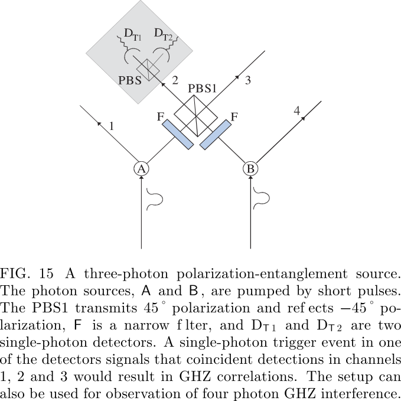

Due to the absence of perfect pair sources
and perfect single photon detectors, in the experiments
both three- and four-photon entanglement is observed only under the condition that there is one and only one photon
in each of the four outputs.

## FALSIFICATION OF A REALISTIC WORLD VIEW

Realism, the cornerstone of classical physics, is a view
that for any physical system (also a subsystem of a compound system), one can find a theoretical description (deterministic or probabilistic) which involves all results of
all possible experiments that can be performed upon it
no matter which experiment actually was performed. Evidently, this directly contradicts the Bohr's complementarity principle. A theory is local if it assumes that information, and influences, cannot travel faster than light.

### Bell's inequality

The following inequalities must be satisfied for
local realistic descriptions

$$
-4 \leq \sum_{s_{1}=\pm 1, s_{2}=\pm 1} S\left(s_{1}, s_{2}\right)\left[E\left(A_{1}, B_{1}\right)+s_{2} E\left(A_{1}, B_{2}\right)\right.+s_{1} E\left(A_{2}, B_{1}\right)+s_{1} s_{2} E\left(A_{2}, B_{2}\right) ] \leq 4
$$

If one chooses a non-factorizable function $$S\left(s_{1}, s_{2}\right)$$, say,
$$\frac{1}{2}\left(1+s_{1}+s_{2}-s_{1} s_{2}\right)$$, the famous CHSH (Clauser, Horne,
Shimony, and Holt, 1969) inequality is recovered
$$
\begin{aligned} S_{\text { Bell }} & \equiv\left|E\left(A_{1}, B_{1}\right)+E\left(A_{1}, B_{2}\right)\right.\\ &+E\left(A_{2}, B_{1}\right)-E\left(A_{2}, B_{2}\right)| \leq 2\end{aligned}
$$

## GHZ theorem

### Impossibility of deriving realism via perfect quantum correlations and locality

Take the GHZ experiment, Fig. 2. Assume that a click
at the local detector $$D_{x_1}$$ , where $$x = d, e, f$$ is described as
a result of value +1, whereas clicks at $$D_{x_2}$$ are ascribed
−1. According to the quantum probabilities (20) the
average values of the product of local results reads
$$
\begin{array}{c}{E\left(\phi_{a}, \phi_{b}, \phi_{c}\right)} \\ {=\sum_{i, j, k=1,2}(-1)^{i+j+k+1} p_{d_{i} e_{j} f_{k}}\left(\phi_{a}, \phi_{b}, \phi_{c}\right)} \\ {=\sin \left(\phi_{A}+\phi_{B}+\phi_{c}\right)}\end{array}\tag{*}
$$

$$
A^{n}(\pi / 2) B^{n}(0) C^{n}(0)=1
$$

where $$ 
X^{n}(\phi) \quad(X=A, B \text { or } C)
 $$s the value of a local
measurement, by Alice, Bob and Cecil, respectively, that
would have been obtained for the n-th particle triple, if
the setting of the measuring device is $$\phi​$$. 
$$
\begin{array}{l}{A^{n}(0) B^{n}(0) C^{n}(\pi / 2)=1} \\ {A^{n}(0) B^{n}(\pi / 2) C^{n}(0)=1}\end{array}
$$
Now, in a local realistic model, from these results we
can deduce a further correlation by simply multiplying
Eqs. Since $$ 
X^{n}(0)^{2}=+1
 $$, regardless of whether
$$ X^{n}(0)=+1
 $$ or −1, we obtain
$$
A^{n}(\pi / 2) B^{n}(\pi / 2) C^{n}(\pi / 2)=1
$$
This, however, is in a full contradiction with the quantum
mechanical prediction obtained from (*) which reads:
$$
A^{n}(\pi / 2) B^{n}(\pi / 2) C^{n}(\pi / 2)=-1
$$

#### Two-observer GHZ-like correlations

Interestingly, the GHZ reasoning can be reduced to
a two-party (thus two space-like separated regions) case
while its all-versus-nothing feature is still retained. One
option is to encode three two-state quantum systems in
distinct degrees of freedom of only two photons. The second option is to find suitable EPR elements of reality
in the two particle case, and to show that they are internally inconsistent. A third protocol of the two-observer GHZ-like the-
orem uses a two-photon hyper-entanglement.

### Refutation of a class of nonlocal realistic theories

Let us discuss the description of the polarization of
photons within such theories. The following assumptions
are made: (L 1 ) realism, (L 2 ) physical states are statistical mixtures of subensembles with definite polarizations,
(L 3 ) local expectation values for polarization measurements taken for each subensemble obey Malus' law. Importantly, locality is not assumed. 

Leggett-type
inequality

$$
\begin{array}{l}{S_{N L H V} \equiv\left|E_{11}(\varphi)+E_{23}(0)\right|+\left|E_{22}(\varphi)+E_{23}(0)\right|} \\ { \leq 4-\frac{4}{\pi}\left|\sin \frac{\varphi}{2}\right|}\end{array}
$$
where $$ 
E_{k l}(\varphi)
 $$ is a uniform average of all correlation functions, defined in the plane of $$ 
\mathbf{a}_{k}
 $$ and $$ 
\mathbf{b}_{l}
 $$ , with the same
relative angle $$\varphi $$. Inequalities avoiding the averaging were
also derived and tested. For the inequality to be applicable, the vectors
$$ \mathbf{a}_{1}
 $$ and $$ \mathbf{b}_{1}$$
  necessarily have to lie in a plane orthogonal
to the one defined by $$ 
\mathbf{a}_{2}
 $$ and $$ 
\mathbf{b}_{2}
  $$. This contrasts with the
CHSH inequality.

## QUANTUM COMMUNICATION

Quantum communication ultimately aims at absolute
security and faithful transfer of information, classical or
quantum.

### Quantum dense coding

The idea of quantum dense coding  is that, by manipulating
only one of the two particles in a Bell state, one can also
encode two bits of information.

The procedure runs as follows:

Step 1. Sharing maximal entanglement. A maximally
entangled qubit pair (say, in the state $$ 
| \psi^{+} \rangle_{A B}
 $$ ) is shared
by Alice and Bob (Fig. 31). They agree in advance
that $$ 
| \psi^{-} \rangle_{A B}, \phi^{-} \rangle_{A B}, \phi^{+} \rangle_{A B}, \text { and } | \psi^{+} \rangle_{A B}
 $$ respectively
represent the binary numbers 00, 01, 10, and 11.

Step 2. Coding of the message. According to the value
Bob wants to transmit to Alice, he performs one out of
four possible unitary transformations (identity operation
$$ \hat{I}, \sigma_{x}, \sigma_{y}, \text { and } \sigma_{z}
 $$) on his qubit B alone. The three non-
I,
identity operations transform, in an one-to-one way, the
original state $$ 
| \psi^{+} \rangle_{A B}
 $$ , respectively, into $$ 
| \phi^{+} \rangle_{A B}, \phi^{-} \rangle_{A B}
 $$ ,
and $$ 
| \psi^{-} \rangle_{A B}
 $$ . Once this is done, Bob sends his qubit to
Alice. Note that this possibility of transforming any of
the four basis states to any other by only manipulating
one of the two qubits holds only for the maximally entangled states. For product (and classical) states it is
always necessary to have control over both qubits (bits)
to encode two bits in four distinguishable states.

Step 3. Decoding of the message. Upon reception, Alice performs a Bell-state measurement, distinguishing between the four code-states and thus allowing her to read
out both bits of information. The quantum dense coding doubles the information capacity of the transmission
channel: what is actually sent is only one qubit. This
more efficient way of coding information at first glance
seems to be at odds with the Holevo theorem (1973),
which states that maximally one bit can be encoded on a
single qubit. Entanglement, a property of pairs of qubits,
allows to circumvent this theorem and to encode infor-
mation entirely in the relative properties of the pair, i.e.
in their correlations.

###  Quantum teleportation

#### Theory: qubit teleportation involving an EPR channel and two bit transfer
see [this](https://gongsiqiu.github.io/quantum/4-Quantum%20manipulation/Teleporting%20an%20unknown%20quantum%20state%20via%20dual%20classical%20and%20Einstein-Podolsky-Rosen%20channels.html) and [this](https://gongsiqiu.github.io/quantum/4-Quantum%20manipulation/Experimental%20quantum%20teleportation.html)

#### Open-destination quantum teleportation

The so-called
open-destination teleportation is a protocol allowing to transfer a state to
one of several potential recipients. It can be decided who
gets the state even after the initial to-be-teleported state,
$$ | x \rangle
 $$, is wiped out in a Bell-state measurement.

Figure 24 shows the basic scheme. One uses a quantum
channel in form of a N +1 qubit GHZ state, say for N = 3
and for polarization qubits:
$$
| \Phi \rangle_{2345}=\frac{1}{\sqrt{2}}( |H\rangle_{2} | H \rangle_{3} | H \rangle_{4} | H \rangle_{5}+| V \rangle_{2} | V \rangle_{3} | V \rangle_{4} | V \rangle_{5} )
$$
and requires, as always, a transfer of two bit classical information. The polarization state to-be-teleported
$$ | \chi \rangle_{1}=\alpha | H \rangle_{1}+\beta | V \rangle_{1}
 $$ is first encoded into an N -particle
coherent superposition of these GHZ particles. By making a Bell state measurement on, say, photons 1 and
2, one projects the remaining photons into one of four
states. E.g. whenever the result of the Bell-state measurement is a $$ 
\psi^{+}
 $$ state, one gets
$$
\frac{1}{\sqrt{2}}(\beta | H\rangle_{3} | H \rangle_{4} | H \rangle_{5}+\alpha | V \rangle_{3} | V \rangle_{4} | V \rangle_{5} )
$$
The state $$ 
| \chi \rangle
 $$ can be read out at any of the three par-
ticles, by performing a suitable projection measurement
on N − 1 of them, here on 2, and a unitary transformation dependent of the received two bits of data, which is carried out on one of the GHZ particles.  Assume
that we want to transfer our state to particle 5. To this
end upon the receipt of information concerning the result
of the BSM, the partner 5 must perform on his particle
a $$ 
\sigma_{x}
 $$ transformation which interchanges polarizations H
and V . The partners
 3 and 4 make measurements in the
$$ | \pm \rangle=( |H\rangle \pm | V \rangle ) / \sqrt{2}
 $$ basis. The recipient of the state
is informed about the measurement results . Once the
recipient gets this additional information, only if there
was just one result associated with a projection to $$ 
|-\rangle
 $$,
he/she performs the sign flipping $$\sigma_z​$$ transformation. The
state is recovered.

### Entanglement swapping

#### Theory

Entanglement swapping, together with entanglement purification, is a key element of the quantum repeater protocol and opens
a way to efficiently distribute entanglement for massive
particles. 
$$
\begin{array}{c}{\Psi \rangle_{1234}=\frac{1}{2}( |\psi^{+}\rangle_{14} | \psi^{+} \rangle_{23}-| \psi^{-} \rangle_{14} | \psi^{-} \rangle_{23}} \\ {-| \phi^{+} \rangle_{14} | \phi^{+} \rangle_{23}+| \phi^{-} \rangle_{14} | \phi^{-} \rangle_{23}}\end{array}
$$
Namely, as soon as Al-
ice completes the Bell-state measurement on particles 2
and 3, we know that photons 1 and 4 are on their way,
ready for detection in an entangled state. In this way
one has the possibility to perform an event-ready test of
Bell’s inequality

Halder et al. (2007) took a different approach to achieve entanglement swapping by a
precise time measurement. The photon detector used in
the experiment was a niobium nitride superconducting
single photon detector with a time resolution of 74ps .
The photons were filtered using 10pm-bandwidth filters,
which corresponds to a coherence time of 350ps well
above the temporal resolution of the detectors. Hence,
ultra-coincidence photon timing could be obtained, and
pulsed sources could be replaced by continuous-wave
sources, which do not require any synchronization.

### Beating noisy environment

An important tool to overcome the noise in the quan-
tum communication channel is entanglement distillation,
concentration and purification

#### Entanglement distillation and concentration

Entanglement concentration aims to obtain with a
nonzero probability a higher entanglement from pure
states with a lower entanglement. There are two methods to achieve this. The first is the so-called Procrustean
method. It requires that the photon pairs are all in a pure non-maximally entangled state,
say, $$ 
| \Psi \rangle_{\text { nonmax }}=\alpha | H \rangle | V \rangle+\beta | V \rangle | H \rangle
 $$, where $$\alpha$$ and $$\beta$$ are
two known amplitudes. In this case, the scheme only involves local filtering operations on single pairs. Second, the Schmidt decomposition scheme works for photon
pairs that are all in a pure but unknown non-maximally
entangled state $$ 
| \Psi \rangle_{\text { nonmax }}
 $$ . In practice, this scheme is
more difficult to implement as it requires simultaneous
collective measurements on many photons.

####  Entanglement purification

The underlying idea of entanglement purification is
that, by using local operations and classical commu-
nication (LOCC) only, to extract from multiple copies
of imperfect states (arbitrary mixed states) fewer copies
of entangled state asymptotically to near-unity fidelity.

The linear-optical purification scheme [shown in Fig.
28(b)] will be presented here using a specific example.
Let our initial state be
$$
\rho_{a b}=F | \phi^{+} \rangle_{a b}\left\langle\phi^{+}|+(1-F)| \psi^{-}\right\rangle_{a b}\left\langle\psi^{-}|\right.
$$
where $$ 
| \psi^{-} \rangle_{a b}
 $$ is an unwanted admixture. The subscripts
a and b indicate the particles at Alice's and Bob's locations, respectively.

Alice and Bob share a big number of pairs described
by $$ 
\rho_{a b}
 $$ . They start by picking at random two such pairs.
Each of them superimposes their photons on a PBS. An
essential step in the purification scheme is to select those
cases for which there is exactly one photon in each of
the four spatial output modes. We shall refer to them
as “four-mode cases”. This corresponds to a projection
onto the subspace in which two photons at the same experimental location (Alice’s or Bob’s) have equal polarization. This is similar to the bilateral CNOT-operation
of the original scheme. Note that the polarizations at
two different locations do not have to be the same. After
performing the purification procedure (selection of four-
mode cases, measurements in modes a4 and b4 in the
+/− basis, and local operations conditional on the mea-
surement results), Alice and Bob will finally create a new
ensemble described by the density operator
$$
\rho_{a b}^{\prime}=F^{\prime} | \phi^{+} \rangle_{a b}\left\langle\phi^{+}\left|+\left(1-F^{\prime}\right)\right| \psi^{-}\right\rangle_{a b}\left\langle\psi^{-}|\right.
$$
with a larger fidelity $$ 
F^{\prime}=F^{2} /\left[F^{2}+(1-F)^{2}\right]
 $$ ] (for
$$ F>1 / 2
 $$) of pairs in the desired state than before thepurification.

Though it seems that only a rather special example, single bit-flip error, has been considered, the same
method actually applies to the arbitrary mixed states
ρ ab , provided that they contain a sufficiently large fraction F > 1/2 of photon pairs in a maximally entangled state. This works as follows: one can first purify
away single bit-flip errors; phase errors can then be easily transformed into bit-flip errors by a $$ 45^{\circ} $$ polarization
rotation and treated in a subsequent purification step. 

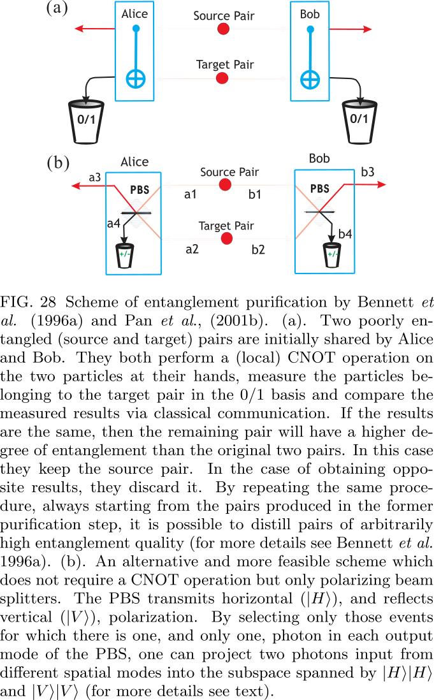

### Quantum memory and quantum repeaters

The quantum repeater protocol provides a
blueprint of a general framework to remedy this problem by nesting entanglement purification and swapping
steps. Once constructed it would enable one to establish
high-quality long-distance entanglement with resources
increasing only polynomially with transmission distance.

#### Quantum repeater protocol

The quantum repeater protocol comprises three elements:

1.  A method for creation of entanglement between
    particles at distant nodes, which uses auxiliary particles at intermediate “connection points” and a
    nested purification protocol.
2. Entanglement purification, even with imperfect
    means.
3. A protocol for which the time needed for entanglement creation scales polynomially, whereas the
    required material resources per connection point
    grow only logarithmically with the distance.

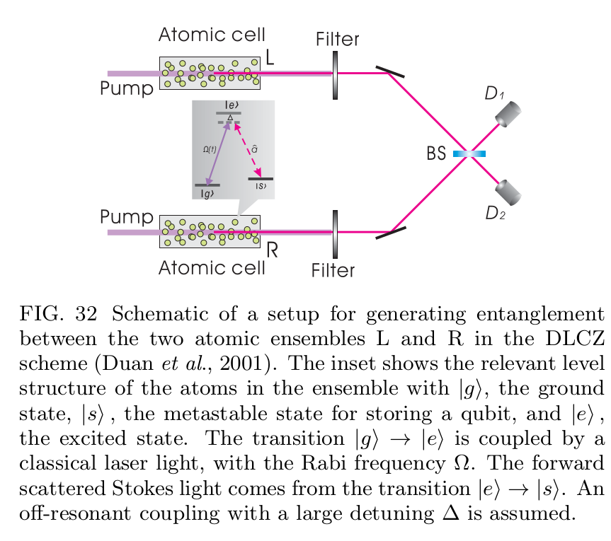

Figure 32 is a schematic of a setup for entangling two
atomic ensembles (optically-thick atomic cells of $$N_\alpha$$ identical atoms) L and R which are spatially separated within
the channel attenuation length. A pair of metastable
lower states $$|g\rangle$$ and $$|s\rangle$$  can correspond to hyperfine or
Zeeman sublevels of electronic ground states of alkali
atoms.

All the atoms are initially prepared in the ground
states $$ 
| g \rangle_{i}
 $$ . A sample is illuminated by a short, off-
resonant laser pulse that induces Raman transitions
into states $$ 
| s \rangle_{i}
 $$ . Particularly important is the forward-scattered Stokes light (the signal mode $$ 
\hat{a}
 $$). It is uniquely correlated with the excitation
the symmetric collective atomic mode $$\hat{S} \equiv\left(1 / \sqrt{N_{a}}\right) \sum_{i} | g \rangle_{i i}\langle s|$$
, where the
summation is taken over all the atoms. The light-atom
interaction generates, after the interaction time $$ 
t_{\Delta}
 $$ , a
two-mode ($$ 
\hat{a} \text { and } \hat{S}
 $$) squeezed state, with the squeezing parameter $$ 
r_{c}
 $$ proportional $$ 
t_\Delta
 $$ . If $$ 
t_\Delta
 $$ is very small, the two-mode squeezed
state can be written in the perturbative form
$$
| \zeta \rangle=| 0_{a} \rangle | 0_{p} \rangle+\sqrt{p_{c}} \hat{S}^{\dagger} \hat{a}^{\dagger} | 0_{a} \rangle | 0_{p} \rangle+O\left(p_{c}\right)\tag{*}
$$
where $$ 
p_{c}=\tanh ^{2} r_{c} \ll 1
 $$ is the small excitation probability and $$ 
O\left(p_{c}\right)
 $$ represents the terms with more excitations,
whose probabilities are equal or smaller than $$ 
p_{c}^{2}
 $$ . The
Hilbert space vectors $$ 
| 0_{a} \rangle \text { and } | 0_{p} \rangle
 $$ are, respectively,
the
atomic and photonic vacuum states with $$ 
| 0_{a} \rangle \equiv \otimes_{i} | g \rangle_{i}
 $$ .
For a large $$N_a$$ , the collectively enhanced signal-to-noise
ratio may strongly boost the efficiency of the scheme.

Though the DLCZ scheme does not meet all the criteria for long-distance quantum communication, it provides a promising approach to a fully controllable single-photon source based on atomic ensembles, which seems
to be much easier for experimental demonstrations. Let
us summarize the basic ideas behind it. The atomic ensemble generates a correlated state in Eq(*) , which is
an exact analog of the SPDC radiation. By measuring
the forward signal mode with a single-photon detector,
under the condition that the detector clicks, the collective atomic mode is projected to a single-excitation state.
Such excitations can be stored for a reasonably long time
in metastable states (the so-called ground-state manifold) of the atoms. On demand the single-atomic excitation can be transferred to a single photon (still within the
storage time) with a method described in the next section. This is with fully controllable properties: the emitted single-photon pulse is directed forward; the emission
time is controllable by the repumping time; and the pulse
shape is controllable by varying the time dependence of
the Rabi frequency of the repumping pulse.

#### Quantum state transfer between matter and photons