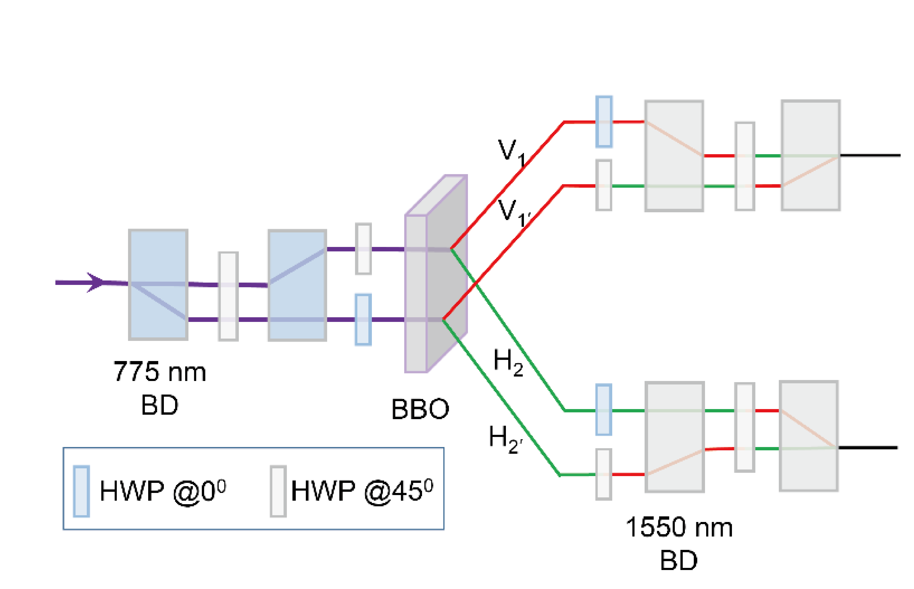
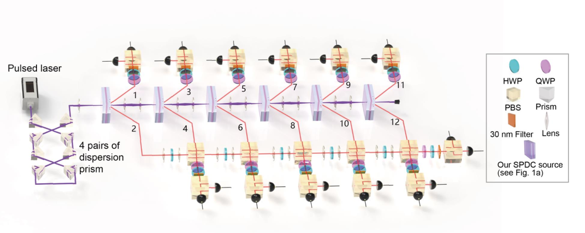

# 12-photon entanglement and scalable scattershot boson sampling with optimal entangled-photon pairs from parametric downconversion{{"Zhong2018a"|cite}}
In the view of quantum engineering,
the single photons should be efficiently prepared in a pure state with a single degree of
freedom. However, usually the uncontrolled entanglement in the frequency and/or time
can significantly degrade the entanglement in the polarization.

Further, beam-like SPDC  was
developed with the photon pairs in the form of two separate Gaussian-like beams, which
had higher brightness and efficiency coupling into a single spatial mode than
those from the non-collinear SPDC where the collection was at intersections of the two
down-converted photon rings.

Generally, due to conservation of momentum in SPDC, a lower momentum
uncertainty of pump beam can lead to a higher collection efficiency. However, a larger
pump beam waist could result in a lower pump energy density. Thus, there is a trade-off
between the collection efficiency and brightness.

Thus, by combining our
SPDC sources with multiplexing with fast and low-loss switches and suitable optical
memories, it is possible to significantly enhance the overall efficiency, opening
a new path to large-scale linear optical quantum computing.

The
key idea of scattershot boson sampling is to use $$k ( k \gg n ) $$heralded single-photon
sources connecting to different input modes of the interferometer, which can achieve an
exponential
$$\left(\matrix{k\\n}\right)$$
times increase in the n-photon count rate to compete against the
intrinsic probabilistic loss $$\sim\varepsilon^n$$ .

generate $$(|H_1\rangle|V_2\rangle+|V_1\rangle|H_2\rangle)/\sqrt{2}$$

By successively passing the laser
through six BBO crystals, we first prepare six pairs of entangled photons.
One photon from each pair is combined with the other five photons on a linear optical
array of five polarization beam splitters (PBSs) that transmit $$H$$ and reflect $$V$$ polarization.
Under this arrangement, post-selecting 12-photon coincidences implies that the output photons are either all $$H$$ or $$V$$ polarized—two cases are quantum mechanically
indistinguishable—thus projecting them into a 12-photon Greenberger-Horne-Zeilinger
(GHZ) state in the form of $$( |H\rangle^{\otimes 12} | V\rangle^{\otimes 12} ) / \sqrt{2}​$$.