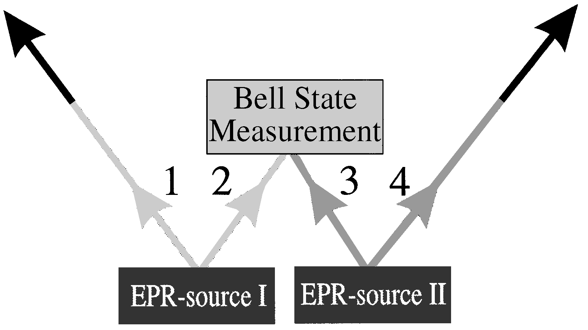
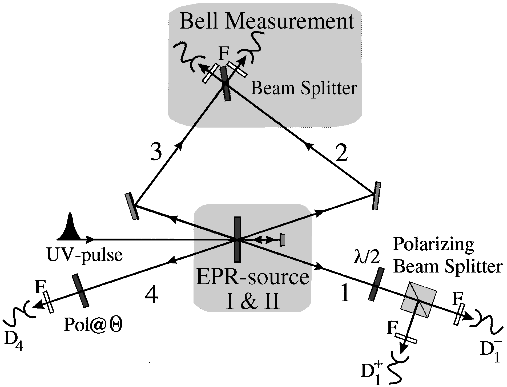

# Experimental Entanglement Swapping: Entangling Photons That Never Interacted{{"Pan1998"|cite}}

We experimentally entangle freely propagating particles that never physically interacted with one
another or which have never been dynamically coupled by any other means. This demonstrates that
quantum entanglement requires the entangled particles neither to come from a common source nor to
have interacted in the past. In our experiment we take two pairs of polarization entangled photons and
subject one photon from each pair to a Bell-state measurement. This results in projecting the other two
outgoing photons into an entangled state.

Consider two EPR sources, simultaneously emitting
each a pair of entangled particles (Fig. 1). In anticipation
of our experiments we assume that these are polarization
entangled photons in the state
$$
|\Psi \rangle_{1234}=\frac{1}{2}(|H \rangle_1|V \rangle_2-|V \rangle_1|H \rangle_2)\times(|H \rangle_3|V \rangle_4-|V \rangle_3|H \rangle_4)\tag{1}
$$
We now perform a joint Bell-state measurement on
photons 2 and 3; that is, photons 2 and 3 are projected onto
one of the four Bell states which form a complete basis for the combined state of photons 2 and 3
$$
|\Psi^\pm \rangle_{23}=\frac{1}{\sqrt{2}}(|H \rangle_2|V \rangle_3\pm |V \rangle_2|H \rangle_3)
$$
$$
|\Phi^\pm \rangle_{23}=\frac{1}{\sqrt{2}}(|H \rangle_2|H \rangle_3\pm |V \rangle_2|V \rangle_3)
$$
This measurement projects photons 1 and 4 also onto a Bell
state, a different one depending on the result of the Bell-
state measurement for photons 2 and 3. Close inspection
shows that for the initial state given in Eq. (1) the emerging
state of photons 1 and 4 will be identical to the one photons
2 and 3 collapsed into. This is a consequence of the fact
that the state of Eq. (1) can be rewritten as
$$
|\Psi \rangle_{1234}=\frac{1}{2}(|\Psi^+ \rangle_{14}|\Psi^+ \rangle_{23}+|\Psi^- \rangle_{14}|\Psi^- \rangle_{23}+|\Phi^+ \rangle_{14}|\Phi^+ \rangle_{23}+|\Phi^- \rangle_{14}|\Phi^- \rangle_{23})
$$
In all cases photons 1 and 4 emerge entangled despite the
fact that they never interacted with one another in the past.
After projection of particles 2 and 3 one knows about the
entanglement between particles 1 and 4.

Note that the Bell-state analysis relies on the interference of two independently created photons. One, therefore, has to guarantee good spatial and temporal overlap at
the beam splitter and, above all, one has to erase all kinds
of path information for photon 2 and for photon 3. Especially the high time and frequency correlations of two photons created by parametric down-conversion can give rise
to Welcher-Weg information for the interfering photons.

We mention that, obviously, registration of a coincidence in the two detectors behind the beam splitter could
also have been caused by two pairs created in either source.
That possibility could clearly be ruled out by sophisticated
detection procedures.

*FIG. 1*. Principle of entanglement swapping. Two EPR
sources produce two pairs of entangled photons, pair 1-2
and pair 3-4. One photon from each pair (photons 2 and
3) is subjected to a Bell-state measurement. This results in
projecting the other two outgoing photons 1 and 4 onto an
entangled state. Change of the shading of the lines indicates
the change in the set of possible predictions that can be made.

*FIG. 2*. Experimental setup. A UV pulse passing through a
nonlinear crystal creates pair 1-2 of entangled photons. Photon
2 is directed to the beam splitter. After reflection, during its
second passage through the crystal the UV pulse creates a
second pair 3-4 of entangled photons. Photon 3 will also be
directed to the beam splitter. When photons 2 and 3 yield a
coincidence click at the two detectors behind the beam splitter,
they are projected into the $$|\Psi^- \rangle_{23}$$ state. As a consequence
of this Bell-state measurement the two remaining photons 1
and 4 will also be projected into an entangled state. To
analyze their entanglement we look at coincidences between
detectors $$D_1^+$$
 and $$D_4$$ , and between detectors $$D_1^-$$
 and $$D_4$$ , for
different polarization angles $$\Theta$$. By rotating the $$\lambda/2$$ plate in
front of the two-channel polarizer we can analyze photon 1
in any linear polarization basis. Note that, since the detection
of coincidences between detectors $$D_1^+$$
 and $$D_4$$, and $$D_1^-$$
 and $$D_4$$ are conditioned on the detection of the $$\Psi^-$$ state, we are
looking at fourfold coincidences. Narrow bandwidth filters (F)
are positioned in front of each detector.

