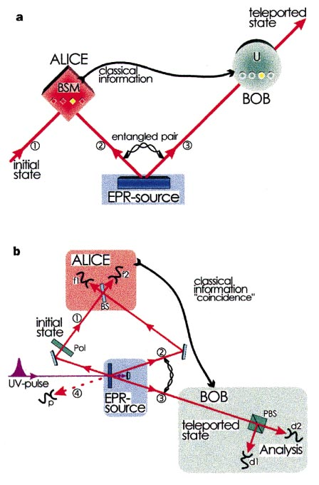
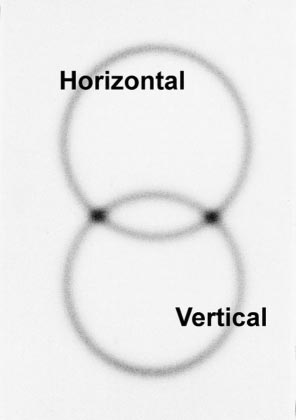

# Experimental quantum teleportation {{"Bouwmeester1997"|cite}}
## Abstract
Quantum teleportation—the transmission and reconstruction over arbitrary distances of the state of a quantum
system—is demonstrated experimentally. During teleportation, an initial photon which carries the polarization that is to
be transferred and one of a pair of entangled photons are subjected to a measurement such that the second photon of
the entangled pair acquires the polarization of the initial photon. This latter photon can be arbitrarily far away from the
initial one. Quantum teleportation will be a critical ingredient for quantum computation networks.

Here we report the first experimental verification of quantum
teleportation. By producing pairs of entangled photons by the
process of parametric down-conversion and using two-photon
interferometry for analysing entanglement, we could transfer a
quantum property (in our case the polarization state) from one
photon to another. The methods developed for this experiment will
be of great importance both for exploring the field of quantum
communication and for future experiments on the foundations of
quantum mechanics.

## The problem
Alice has some particle in a certain quantum state
$$
| \psi \rangle= \alpha|\leftrightarrow \rangle +\beta |\updownarrow \rangle
$$
where $$\alpha$$ and $$\beta$$ are two complex numbers satisfying $$|\alpha|^2+|\beta|^2=1$$.

and she wants Bob, at a distant location, to have a particle in that
state.
Suppose that the communication channel between
Alice and Bob is not good enough to preserve the necessary
quantum coherence or suppose that this would take too much time, what strategy can Alice and
Bob pursue?

## The concept of quantum teleportation
The teleportation scheme works as follows. Alice has the particle 1
in the initial state $$| \psi \rangle_1$$ and particle 2. Particle 2 is entangled with
particle 3 in the hands of Bob. The essential point is to perform a
specific measurement on particles 1 and 2 which projects them onto
the entangled state:
$$
|\psi^- \rangle_{12}=\frac{1}{\sqrt{2}}(|\leftrightarrow \rangle_1|\updownarrow \rangle_2 - |\updownarrow \rangle_1|\leftrightarrow \rangle_2)
$$
Quantum physics predicts 1 that once particles 1 and 2 are
projected into $$|\psi^- \rangle_{12}$$ , particle 3 is instantaneously projected into
the initial state of particle 1.
(I think the explantion is concise)
The reason for this is as follows. Because
we observe particles 1 and 2 in the state $$|\psi^- \rangle_{12}$$ we know that whatever
the state of particle 1 is, particle 2 must be in the opposite state, that
is, in the state orthogonal to the state of particle 1. But we had
initially prepared particle 2 and 3 in the state $$|\psi^- \rangle_{23}$$ , which means
that particle 2 is also orthogonal to particle 3. This is only possible if
particle 3 is in the same state as particle 1 was initially. The final state
of particle 3 is therefore:
$$
| \psi \rangle_3= \alpha|\leftrightarrow \rangle_3 +\beta |\updownarrow \rangle_3
$$
It is also important to notice that the Bell-state measurement does
not reveal any information on the properties of any of the particles.

 

*Figure 1*  Scheme showing principles involved in quantum teleportation *(a)* and
the experimental set-up *(b)* . *a*, Alice has a quantum system, particle 1, in an initial
state which she wants to teleport to Bob. Alice and Bob also share an ancillary
entangled pair of particles 2 and 3 emitted by an Einstein–Podolsky–Rosen (EPR)
source. Alice then performs a joint Bell-state measurement (BSM) on the initial
particle and one of the ancillaries, projecting them also onto an entangled state.
After she has sent the result of her measurement as classical information to Bob,
he can perform a unitary transformation (U) on the other ancillary particle resulting
in it being in the state of the original particle. *b*, A pulse of ultraviolet radiation
passing through a nonlinear crystal creates the ancillary pair of photons 2 and 3.
After retroflection during its second passage through the crystal the ultraviolet
pulse creates another pair of photons, one of which will be prepared in the initial
state of photon 1 to be teleported, the other one serving as a trigger indicating that
a photon to be teleported is under way. Alice then looks for coincidences after a
beam splitter BS where the initial photon and one of the ancillaries are
superposed. Bob, after receiving the classical information that Alice obtained a
coincidence count in detectors f1 and f2 identifying the |w − i 12 Bell state, knows that
his photon 3 is in the initial state of photon 1 which he then can check using
polarization analysis with the polarizing beam splitter PBS and the detectors d1
and d2. The detector p provides the information that photon 1 is under way. 

## Experimental realization
We produced the entangled photons 2 and 3 by parametric downconversion.
To achieve projection of photons 1 and 2 into a Bell state we have
to make them indistinguishable. To achieve this indistinguishability
we superpose the two photons at a beam splitter (Fig. 1b).
To make sure that photons 1 and 2 cannot be distinguished by
their arrival times, they were generated using a pulsed pump beam
and sent through narrow-bandwidth filters producing a coherence
time much longer than the pump pulse length.

How can one experimentally prove that an unknown quantum
state can be teleported? First, one has to show that teleportation
works for a (complete) basis, a set of known states into which any
other state can be decomposed.
Second, one has to show that teleportation
works for superpositions of these base states.

*Figure 2* Photons emerging from type II down-conversion (see text). Photograph 
taken perpendicular to the propagation direction. Photons are produced in pairs. 
A photon on the top circle is horizontally polarized while its exactly opposite 
partner in the bottom circle is vertically polarized. At the intersection points their 
polarizations are undefined; all that is known is that they have to be different, 
which results in entanglement.

