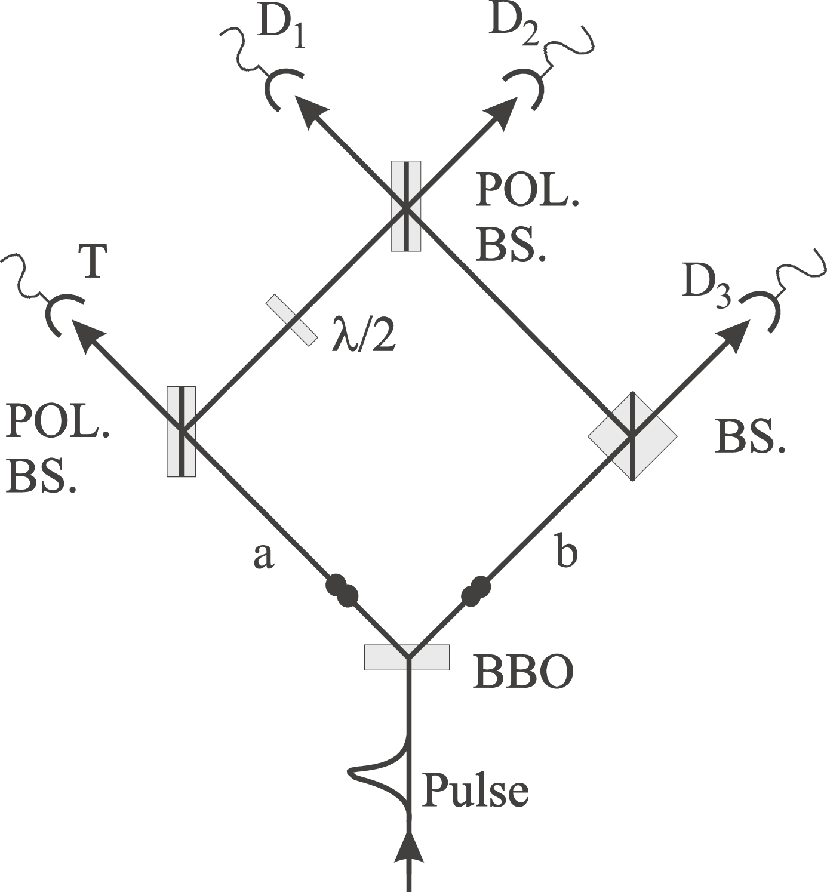

# Observation of Three-Photon Greenberger-Horne-Zeilinger Entanglement {{"Bouwmeester1999"|cite}}

We present the experimental observation of polarization entanglement for three spatially separated
photons. Such states of more than two entangled particles, known as Greenberger-Horne-Zeilinger
(GHZ) states, play a crucial role in fundamental tests of quantum mechanics versus local realism and
in many quantum information and quantum computation schemes. Our experimental arrangement is
such that we start with two pairs of entangled photons and register the photons in a way that any
information as to which pair each photon belongs to is erased. After detecting a trigger photon, the
registered events at the detectors for the remaining three photons exhibit the desired GHZ correlations.

The main idea is to
transform two pairs of polarization entangled photons into
three entangled photons and a fourth independent photon. In our experiment the GHZ entanglement is observed
only under the condition that both the trigger photon and
the three entangled photons are actually detected. Thus,
detection plays the double role of both projecting into the
GHZ state and performing a specific measurement on the
state.

*FIG. 1*. Schematic drawing of the experimental setup for the
demonstration of the Greenberger-Horne-Zeilinger entanglement for spatially separated photons. Conditioned on the registration of one photon at the trigger detector T, the three
photons registered at  and  exhibit the desired GHZ
correlations.

The pair
creation is such that the following polarization entangled
state is obtained:
$$
\frac{1}{\sqrt{2}}(|H \rangle_a|V \rangle_b-|V \rangle_a|H \rangle_b)
$$
The setup is such that arm a continues towards a
polarizing beam splitter, where V photons are reflected
and H photons are transmitted towards detector T (behind
an interference filter $$\delta \lambda=$$ ­ 4.6 nm at 788 nm). Arm b
continues towards a 50y50 polarization-independent beam
splitter. From each beam splitter, one output is directed
to a final polarizing beam splitter. In between the two
polarizing beam splitters, vertical polarization is rotated to
$$45^\circ$$ polarization using a $$\lambda/2$$ plate. The remaining three
output arms continue through interference filters ($$\delta \lambda=$$ ­
3.6 nm) and single-mode fibers towards the single-photon
detectors $$D_1, D_2 ,$$ and $$D_3$$ .

Consider two down-conversions
producing the product state
$$
\frac{1}{2}(|H \rangle_a|V \rangle_b-|V \rangle_a|H \rangle_b)(|H \rangle_a'|V \rangle_b'-|V \rangle_a'|H \rangle_b')\tag{1}
$$
Initially, we assume that the components $$|H \rangle_{ab}$$ and $$|V \rangle_{ab}$$
created in one down-conversion might be distinguishable
from the components $$|H \rangle_{ab}'$$ and $$|V \rangle_{ab}'$$ created in the
other one. The evolution of the individual components
of state (5) through the apparatus towards the detectors $$T,
D_1, D_2,$$ and $$D_3$$ is given by
$$
|H \rangle_a \rightarrow |H \rangle_T
$$
$$
|V \rangle_b\rightarrow\frac{1}{\sqrt{2}}(|V \rangle_2+|V \rangle_3)
$$
$$
|V \rangle_a\rightarrow\frac{1}{\sqrt{2}}(|V \rangle_1+|H \rangle_2)
$$
$$
|H \rangle_b\rightarrow\frac{1}{\sqrt{2}}(|H \rangle_1+|H \rangle_3)
$$
Inserting these expressions into state (1) and restricting
ourselves to those terms where only one photon is found
in each output we obtain, after normalization,
$$
\frac{1}{2}\{|H \rangle_T(|H \rangle_1'|H \rangle_2'|V \rangle_3+|V \rangle_1'|V \rangle_2|H \rangle_3')+|H \rangle_T'(|H \rangle_1|H \rangle_2|V \rangle_3'+|V \rangle_1|V \rangle_2'|H \rangle_3)\}
$$
If now the experiment is performed such that the photon
states from the two down-conversions are indistinguishable, we finally obtain the desired state
$$
\frac{1}{\sqrt{2}}|H \rangle_T(|H \rangle_1|H \rangle_2|V \rangle_3+|V \rangle_1|V \rangle_2|H \rangle_3)\tag{2}
$$
To experimentally demonstrate that GHZ entanglement has been obtained by the method described above,we first verified that, conditioned on a photon detection by the trigger T, both the $$H_1 H_2 V_3$$ and the $$V_1 V_2 H_3$$
components can be observed, but no others.
Existence of the two terms as just demonstrated is a necessary
but not yet sufficient condition for demonstrating GHZ
entanglement. In fact, there could, in principle, be just a
statistical mixture of those two states. Therefore, one has
to prove that the two terms coherently superpose. This
we did by a measurement of linear polarization of photon
1 along $$+45^\circ$$ , bisecting the H and V directions.

For an additional confirmation of state (2) we performed measurements conditioned on the detection of

the photon at $$D_1​$$ under $$0^\circ​$$ polarization(i.e., V polarization).
 For the GHZ state $$ \frac{1}{\sqrt{2}}(|H \rangle_1|H \rangle_2|V \rangle_3+|V \rangle_1|V \rangle_2|H \rangle_3) ​$$ this implies that the remaining two photons
should be in the state $$|V \rangle_2|H \rangle_3​$$ which cannot give rise to
any correlation between these two photons in the $$45^\circ​$$ detection basis.

*FIG. 2*. Experimental confirmation of GHZ entanglement.
Graph (a) shows the results obtained for polarization analysis of
the photon at $$D_3 ​$$, conditioned on the trigger, and the detection
of one photon at $$D_1​$$ polarized at $$45^\circ​$$ and one photon at
detector $$D_2​$$ polarized at $$-45^\circ​$$ . The two curves show the
fourfold coincidences for a polarizer oriented at $$-45^\circ​$$ and $$45^\circ​$$ ,
respectively, in front of detector $$D_3​$$ as a function of the spatial
delay in path *a*. The difference between the two curves at zero
delay confirms the GHZ entanglement. By comparison [graph
( b)] no such intensity difference is predicted if the polarizer in
front of detector $$D_1​$$ is set at $$0^\circ​$$ . Error bars are given by the
square root of the coincidence counts.

