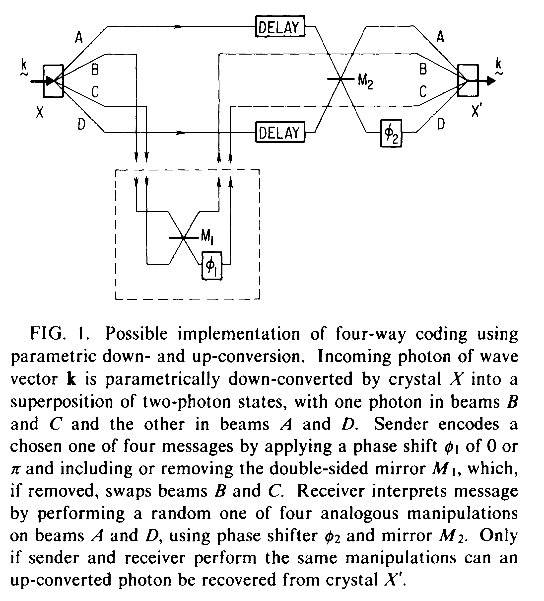

# Communication via one- and two-particle operators on Einstein-Podolsky-Rosen states{{"Bennett1992a"|cite}}

As is well known, operations on one particle of an Einstein-Podolsky-Rosen (EPR) pair cannot
influence the marginal statistics of measurements on the other particle. We characterize the set of states
accessible from an initial EPR state by one-particle operations and show that in a sense they allow two
bits to be encoded reliably in one spin$$-\frac{1}{2}$$ particle: One party, “Alice,” prepares an EPR pair and sends
one of the particles to another party, “Bob,” who applies one of four unitary operators to the particle,
and then returns it to Alice. By measuring the two particles jointly, Alice can now reliably learn which
operator Bob used.

We show that such interactions can be used to
prepare all and only those states of the joint system (two
particles and ancilla) that yield unperturbed marginal
statistics for all measurements on the other particle, with
which the ancilla did not interact.

We now demonstrate the equivalence between states
accessible through one-particle operators and states with
random marginal statistics for the untreated particle.
A general expression for a pure state of the tripartite
system comprising the two EPR particles and the ancilla is
$$
|\Phi \rangle=|\uparrow\uparrow \rangle|A \rangle+|\downarrow\downarrow \rangle|B \rangle+|\uparrow\downarrow \rangle|C \rangle+|\uparrow\uparrow \rangle|D \rangle
$$
$$
\langle A|A \rangle +\langle B|B \rangle+\langle C|C \rangle+\langle D|D \rangle=1
$$

$$
|\phi \rangle=\frac{\cos \theta}{\sqrt{2}}(e^{i \alpha}|\uparrow\uparrow \rangle+e^{i \beta}|\downarrow\downarrow \rangle)+\frac{\sin \theta}{\sqrt{2}}(e^{i \gamma}|\uparrow\downarrow \rangle+e^{i \delta}|\downarrow\uparrow \rangle)
\tag{1}
$$
$$
\delta+\gamma=\pi+\alpha+\beta \tag{2}
$$

The symmetry of Eqs. (1) and (2) with respect to the
coefficients of $$|\uparrow\downarrow \rangle$$ and $$|\downarrow\uparrow \rangle$$ implies that unitary operations on one particle of an EPR pair, without ancilla, cannot influence the marginal statistics of either particle, not
even the one the operator has acted upon.

It is noteworthy that the manifold defined by Eqs. (1)
and (2), i.e., the set of states preparable by one-particle
unitary operators on an initial EPR state, is a proper subset, but not a subspace, of all two-particle pure states.
It includes states such as

$$
\begin{align}
&\sqrt{1/2}(|\uparrow\downarrow \rangle-|\downarrow\uparrow \rangle),\sqrt{1/2}(|\uparrow\downarrow \rangle+|\downarrow\uparrow \rangle),\\
&\sqrt{1/2}(|\uparrow\uparrow \rangle-|\downarrow\downarrow \rangle),\sqrt{1/2}(|\uparrow\uparrow \rangle+|\downarrow\downarrow \rangle),\tag{3}
\end{align}
$$
The orthonormality of Eq. (3) means that manipulations of one particle of a separated EPR pair, while they
cannot be used to communicate directly with the untreated particle, can be used to encode four reliably distinguishable messages in the two-particle system. To perform this feat, Alice, the intended receiver of the message, first prepares a pure EPR state and lends one particle of the pair to Bob, the intended sender. Bob then
operates on the particle via one of four unitary operators
so as to put the two-particle system into a chosen one of
the four states of Eq. (3) and then returns the treated
particle to Alice. Now possessing both particles, Alice
can in principle measure them jointly in the orthonormal
basis of Eq. (3), and so reliably learn which operator
Bob applied.

From one viewpoint, this is surprising, because Bob has
communicated a two-bit message by unitarily operating
on a single spin$$-\frac{1}{2}$$ particle. Thinking too classically, one
might be tempted to say that his manipulations have
therefore placed the treated particle into four reliably distinguishable states, contradicting a basic principle of
quantum mechanics that such a particle can have only
two reliably distinguishable states. But the scheme also
depends on the untreated particle. It therefore might be
better to say, as Schumacher suggests, that one of the
two bits is sent forward in time through the treated particle, while the other bit is sent backward in time to the
EPR source, then forward in time through the untreated
particle, until finally it is combined with the bit in the
treated particle to reconstitute the two-bit message. Because the bit “sent backward in time” cannot be used to
transmit a meaningful message without the help of the
other particle, no opportunity for time travel or superluminal communication is created, just as none is created
in the classic EPR experiment in which simultaneous
measurements are used to establish non-message-bearing
correlations over a spacelike interval.

The EPR scheme has the advantage of allowing some of
the particle transmissions to take place before the message has been decided upon, perhaps at cheaper “off-peak” rates.

