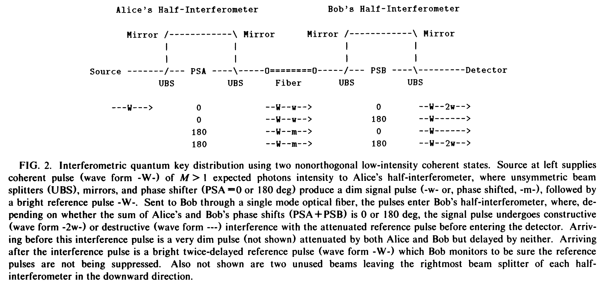

# Quantum Cryptography Using Any Two Nonorthogonal States{{"Bennett1992"|cite}}

Here we show that in principle any two nonorthogonal quantum states
suffice, and describe a practical interferometric realization using low-intensity coherent light pulses.

Two of the main
goals of cryptography: encrypting a subsequent meaningful message to make it unintelligible to a third party,
and certifying to the legitimate receiver that a message
(plain or encrypted) has not been altered in transit.

The security of non-EPR key distribution
schemes is derived from the fact that any measurement
which fails to disturb each of two nonorthogonal states
also fails to yield any information distinguishing them.

Let $$|u_0\rangle​$$and  $$|u_1\rangle​$$ be two distinct, nonorthogonal states,
and let $$P_0=1-|u_1\rangle\langle u_1|​$$ and $$P_1=1-|u_0\rangle\langle u_0|​$$ be (noncommuting) projection operators onto subspaces orthogonal to $$|u_0\rangle​$$ and  $$|u_1\rangle​$$, respectively (note reversed order of
indices). Thus $$P_0​$$ annihilates $$|u_1​$$, but yields a positive
result with probability
$$1-|\langle u_0| u_1\rangle|^2​$$ when applied to
$$|u_0\rangle​$$, and vice versa for $$P_1​$$ 

To begin the key distribution, Alice prepares and sends
Bob a random binary sequence of quantum systems, using
states $$|u_0\rangle​$$ and $$|u_1\rangle​$$ to represent the bits 0 and 1, respectively. Bob then decides, randomly and independently of
Alice for each system, whether to subject it to a measurement of  $$P_0​$$ or $$P_1​$$. Next Bob publicly tells Alice in which
instances his measurement had a positive result (but not,of course, which measurement he made), and the two
parties agree to discard all the other instances.

If there has been no eavesdropping, the remaining instances, a fraction approximately $$(1-|\langle u_0| u_1\rangle|^2)/2$$ of
the original trials, should be perfectly correlated, consisting entirely of instances in which Alice sent $$|u_0\rangle$$ and Bob
measured $$P_0$$, or Alice sent $$|u_1\rangle$$ and Bob measured $$P_1$$.
However, before Alice and Bob can trust this data as key,
they must, as in other key distribution schemes, sacrifice
some of it to verify that their versions of the key are
indeed identical. This also certifies the absence of eavesdropping, which would necessarily have disturbed the
states $$|u_0\rangle$$ or$$|u_1\rangle$$ in transit, causing them sometimes to
yield positive results when later subjected to measurements $$P_1$$ or $$P_0​$$ , respectively.

This third pulse contains no phase information, but serves to confirm that the reference pulse has actually arrived. It thus protects against an attack in which
an eavesdropper (“Eve”) would measure each signal-
reference pulse pair by an apparatus similar to Bob's,
resend a correctly fabricated pulse pair whenever she was
successful, and suppress both the signal and reference
pulses when she was unsuccessful, thereby eavesdropping
on the channel without creating errors in Bob's subsequent measurement results. Eve cannot suppress the
reference pulse without immediately being caught. But if
she suppresses only the signal pulse, the uncancelled reference pulse will still produce a count in Bob's detector
with probability ,$$\mu Tq$$, and half these counts will result in
errors in Bob's key.

Since any pair of coherent or incoherent optical signals
become significantly nonorthogonal at low intensity, it
would seem that almost any source of two kinds of dim
light flash could be used for key distribution
without the complications of interferometry. However,
a more intrusive Eve, who stands between Alice and Bob,
can thoroughly subvert the scheme by intercepting all AIice’s flashes, and resending a flash to Bob
only when she succeeds in seeing Alice’s flash herself,
while simply stopping the others. By contrast, in the interferometric scheme of Fig. 2, there is no fake signal an
eavesdropper can substitute to hide her failure to detect
the original signal, and the scheme remains secure.