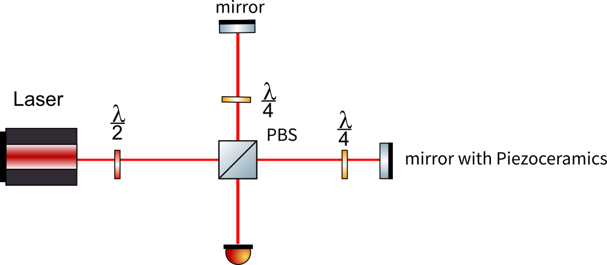

# 4.1~4.7

## 工作内容

本周主要参与了测试探测器效率，尝试稳定相位噪声，清理平台，学习了收光。

## 技术细节

### 清洁光纤截面

1. 使用光纤放大器观察截面是否干净，重点为中心区域。观察时光纤对准接口后插入，注意不要拉扯光纤。
2. 清洁。 将擦镜纸折叠，注意不要碰到中心区域，用镊子加好，纸巾露出小部分，喷洒乙醇和乙醚。擦拭时缓慢从一侧擦向另一侧。

### 调节偏振

依次缓慢旋转三个半圆板，使计数达到最大。**调节时需要迭代**

### 判断符合计数是否为随机符合

$$
N_{12}>\frac{N_1N_2}{N}
$$

$$N$$ 为脉冲数，$$N_i$$为到达探测器i的计数，$$N_{12}$$为同时到达1,2的计数。

### 调节偏置电流

目标是提高探测器效率，降低暗计数。一般偏置电流越大，效率越高，暗计数越大。

### 收光

#### 两个耦合器

耦合器有四个自由度，两个旋钮调整x,y方向位置，两个用扳手调节的旋钮控制角度(有相应的微调旋钮)。同时后面的旋钮可调节光纤与透镜的距离以产生准平行光。

收光时两束激光分别从两个耦合器打入，先在近处调节x,y，使光点重合，再在远处调整角度，多次迭代，同时调整光线位置，使之成为准平行光。

 	注：手持激光源的亮度通过拔动接口调节，切换模式可使之闪烁。

初步调好后将手持激光器换为功率计。注意功率计设定的波长与激光波长相匹配。调节耦合器，使功率最大。

#### 双镜调节

很多时候不能调节耦合器，这时需要利用两个反射镜收光。注意反射镜设计的反射角度，大多为$$45^\circ$$反射。调节时同时调整两反射镜的x方向或y方向。

## 测量噪声

用CCD观察干涉效果，用示波器观察噪声引起的相位漂移。

## 轶事

1. 曾经发现某一个探测器的几个通道趋势与之前的完全不一样。原因是没测6号通道，9号通道测量了两次。
2. 观察噪声时发现噪声过大，其他扰动淹没在噪声中。原因是连接线坏了。