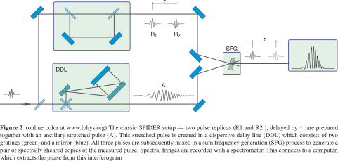
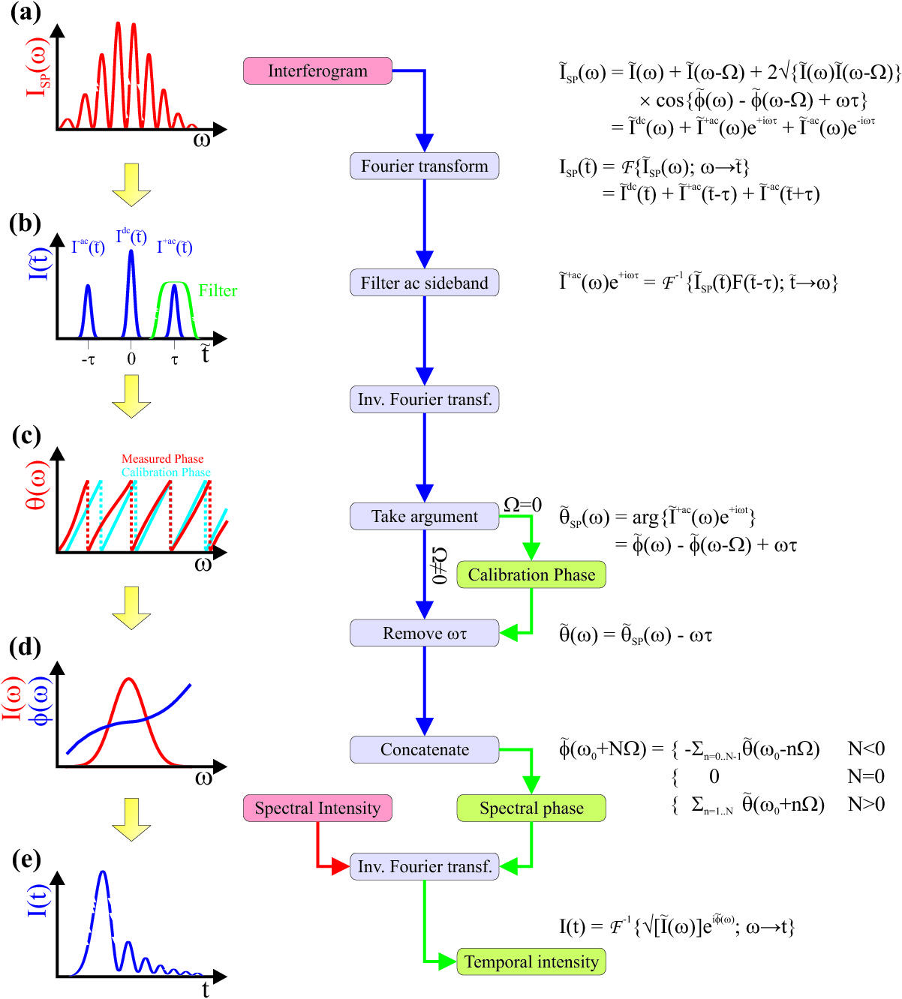

# 5.20~5.31

## 工作内容

使用SPIDER（Spectral Phase Interferometry for
Direct Electric-field Reconstruction）方法测激光器不同波长之间的相位差$$\times 4$$

## 技术细节

### 实验原理

### 实际情况

1. 实验中是通过将一束光等光程先分再合，再插入玻璃片实现延时的。玻璃片的厚度决定延时$$\tau$$的大小，同时决定了光谱干涉条纹的密集程度。玻璃片越厚，$$\tau$$越大，条纹越密集，对谱仪分辨率要求越高。
2. 光谱仪的分辨率可通过调节狭缝的大小控制。狭缝越小，分辨率越高，单位时间内的计数越少。因此需要选取合适的狭缝宽度以及曝光时间。分辨率过低，不能得到干涉中降到底的图象。分辨率过高，计数较少，统计误差影响较大。若通过增加曝光时间提高计数，则会出现对时间平均后对比度下降的问题。
3. BBO晶体是非线性晶体，不仅可以用来实现SPDC，若实现相位匹配，也可以用来倍频与和频。实现和频是这一实验的难点。由于光栅不能承受高功率的激光，生成的紫光不明显。最开始采用非共线的方法，这样信噪比高，和频光在两个倍频光之间，但调节难度极高，最后放弃。后来采用共线的方法。这时较容易看到紫光，但信噪比低。调节时需要挡住一路光，看紫光是否消失，以判断是否为和频光。
4. 如果两光栅平行度足够好，经过色散的光打到反射镜后是可以原路返回，重新变成一个光斑的。因此调节光栅平行至关重要。大致使得第二个光栅出来的衍射光与激光器出来的光平行可得到较好的平行度，再做微调，使得逐渐挡住反射镜上的光使得光斑只有亮度变化，而无形状变化，则说明已经调好。
5. 色散光与延时光两路需要能够发生干涉，因此光程需要大致相等。实验中通过步进电机控制的平移台调节直角反射镜对的位置使两边光程差在相干长度的范围内。这一对反射镜要垂直，平移台一定要与光路平行，否则调整时光斑会发生较大偏移。

## 轶事

我们一共测了四次，将光栅距离改短，改长，再改短。要实现和仪器的分辨率相匹配也不是一件容易的事情。