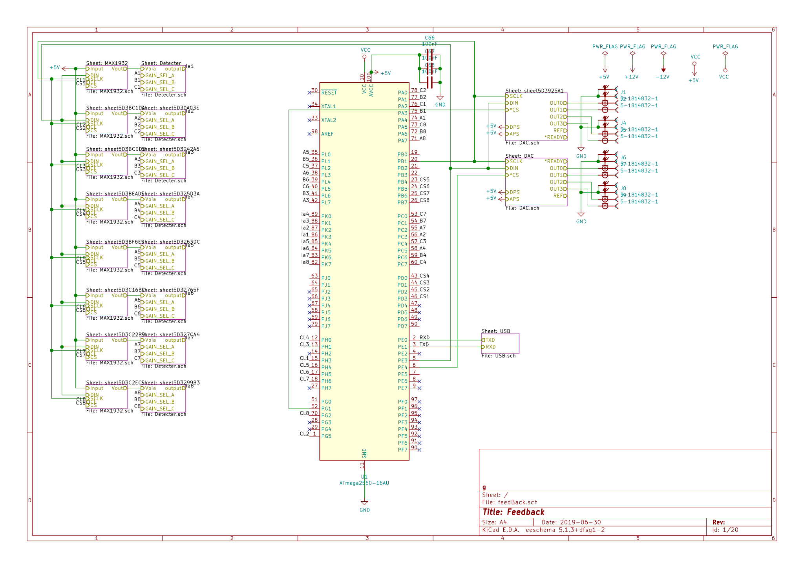
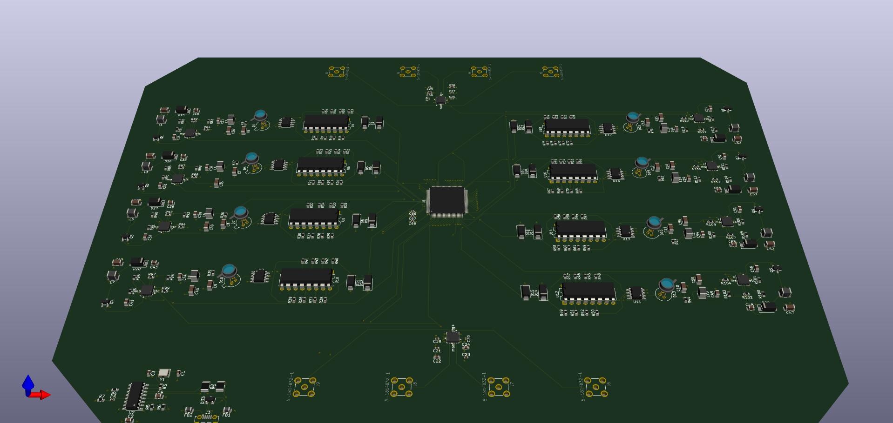

# 6.28~7.30

## 工作内容

绘制用于GBS负反馈稳相的电路板，补偿激光器色散，搭纠缠源

## 技术细节

### PCB
#### 原理图

#### 3D视图

### 色散补偿

通过两对棱镜来补偿色散

## 轶事

1. 我们发现激光器附近空间不够放置色散补偿，只好拆了那里的两对源重搭。
2. 调光斑大小时曾发现大小会变化，探究一晚上，发现是一个衰减片的影响。
3. 当八对源搭好之后发现有重大问题，纯度不够，重新调整后解决。
4. 挑元件，挑封装也不是一件容易的事情。
5. 电路板看上去重复的部分很多，我其实仍然是一个个元件摆，一根根线连。折腾好久之后才找到“复制”的办法。
6. 线连完，其实我自己都不想再看一遍，不知道专家们审得怎样了。
7. 开始大量擦镜子了，我提议用超声波擦，不知到现在怎么样了。

